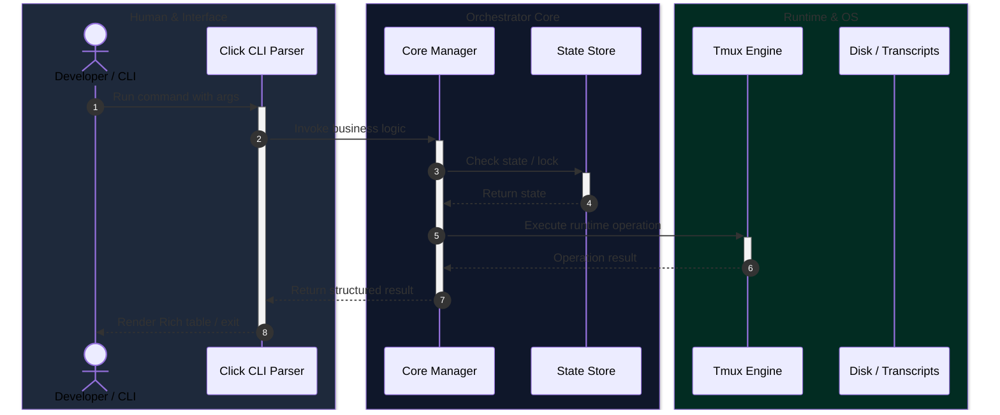
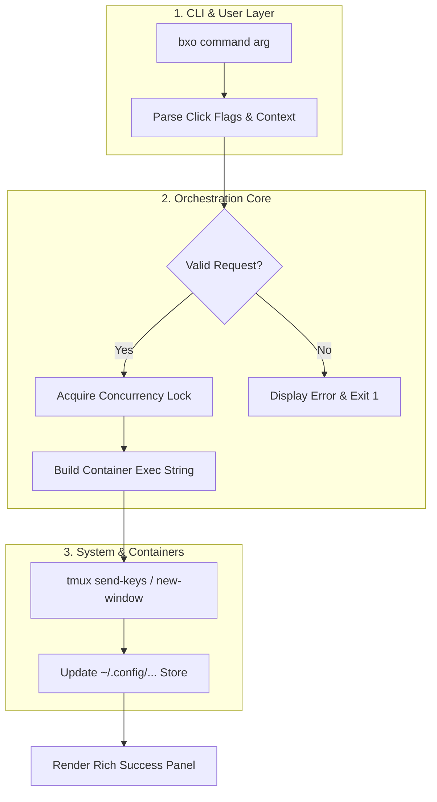

# Visual Diagrammer Skill

## Overview
A comprehensive guide and standard for generating clear, high-contrast, syntax-valid technical diagrams. Specializes in Sequence Diagrams and Swimlane Activity/Flow Diagrams for system architecture, CLI command flows, and distributed agent workflows.

---

## Tool Selection Matrix & Rationale

| Criterion | **Mermaid** (Recommended) | **PlantUML** | **Graphviz (DOT)** |
|---|---|---|---|
| **Rendering Support** | Native in GitHub, GitLab, VS Code, JetBrains, Web Markdown, and AGY Chat/Artifacts | Requires Java runtime + `plantuml.jar` or external web server | Requires local `dot` CLI / Graphviz package |
| **Sequence Support** | Excellent (`sequenceDiagram` with `box` swimlane groupings, activations, notes) | Excellent (`actor`, `boundary`, `control`, `database`, `collections`) | Poor (DOT is for graphs, not sequences) |
| **Swimlane Support** | Excellent via `subgraph` blocks in `flowchart` or `box` regions in `sequenceDiagram` | Native swimlanes (`|lane|`) in activity diagrams | Cluster subgraphs (`subgraph cluster_X`) |
| **Portability** | 100% portable text, zero external dependencies | Requires image compilation step for markdown viewing | Requires image compilation step |
| **Markdown / Docs Fit** | **Optimal** — renders directly inside Antigravity artifacts and Markdown viewers | Secondary — requires offline image rendering | Good for file dependency trees |

### Why Mermaid is Chosen for Box-Orchestrator
1. **Zero External Dependencies**: Renders out-of-the box in Markdown viewers, GitHub web UI, and AGY markdown artifacts without needing Java JRE, Graphviz binaries, or remote network rendering.
2. **First-Class Swimlane Capabilities**:
   - In **Sequence Diagrams**: Supported using `box <color> <Lane Title>` surrounding participants, visually segregating User, CLI, Core Services, and External Runtimes.
   - In **Flowcharts**: Supported using nested `subgraph` blocks for logical swimlanes.
3. **High Maintainability**: Plain-text, git-diff friendly syntax that can be edited by humans and AI directly.

---

## Swimlane Sequence Diagram Pattern (Mermaid)

When showing interaction across logical layers or subsystems, group participants into `box` swimlanes:

---

## Swimlane Flowchart Pattern (Mermaid)

When showing decision-heavy lifecycle flows across system boundaries:

---

## Key Best Practices

1. **Explicit Identifiers**: Always give nodes and participants clear identifiers (`actor U as User`, `participant C as ConfigManager`).
2. **Quote Special Characters**: Wrap labels containing parentheses, dashes, or brackets in double quotes (e.g. `node["Get Config (JSON)"]`).
3. **Show Alternative / Error Paths**: Use `alt / else / end` or `opt` blocks in sequence diagrams to depict error handling and quota depletion.
4. **Lane Semantics**: Group related components into consistent visual swimlanes:
   - **User / Client Layer**: User, CLI entry points, REST/MCP requests.
   - **Coordination Layer**: Concurrency, Selectors, Config managers, Session store.
   - **Infrastructure Layer**: Docker / Host container paths, Tmux server, filesystem, Agent usage CLI.
5. **No Visual Noise**: Avoid overly tangled lines by keeping sequences ordered strictly by time and causality.
