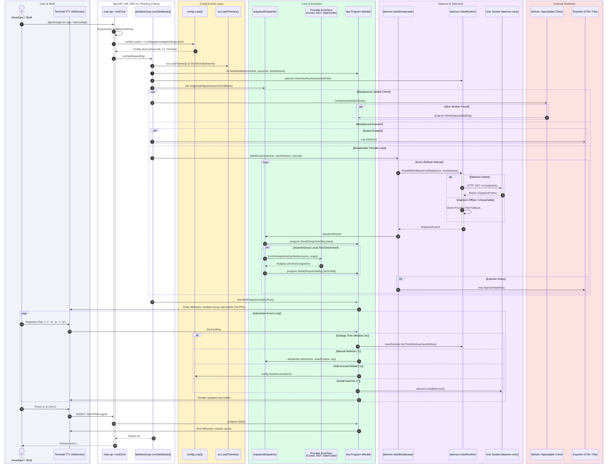
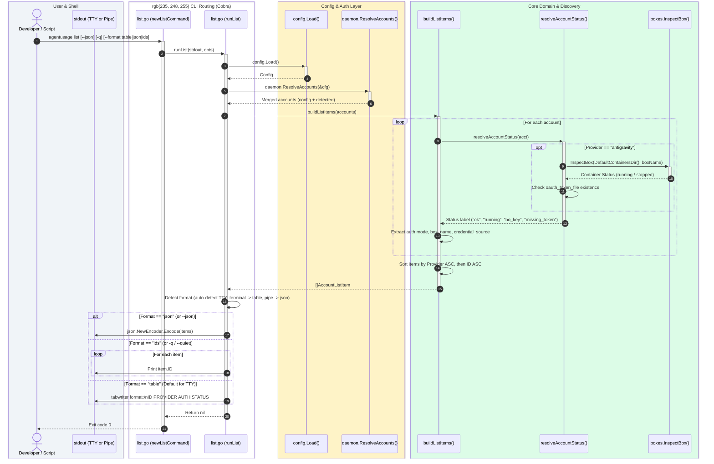
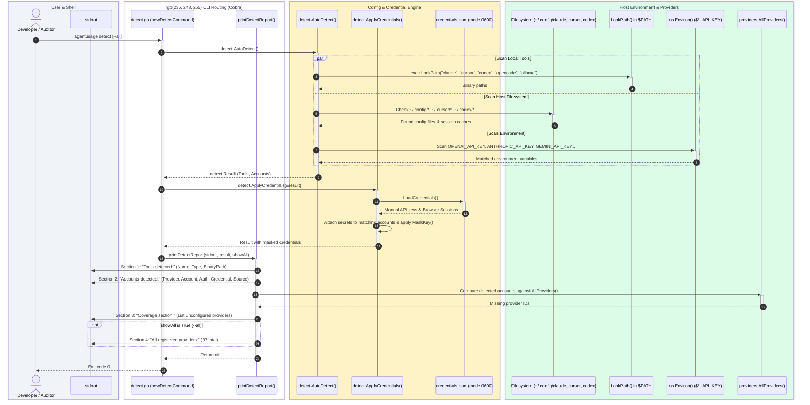
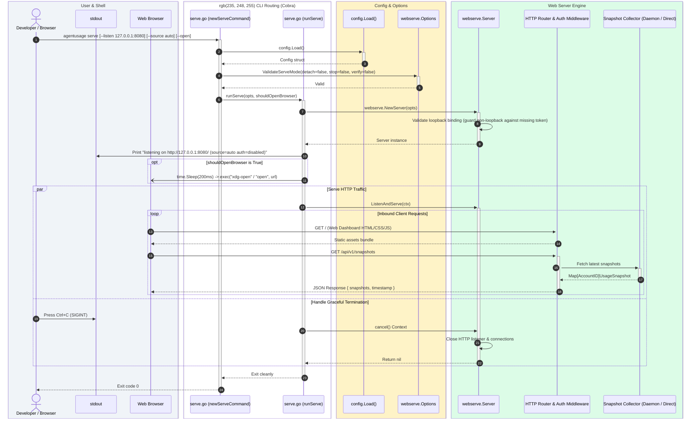
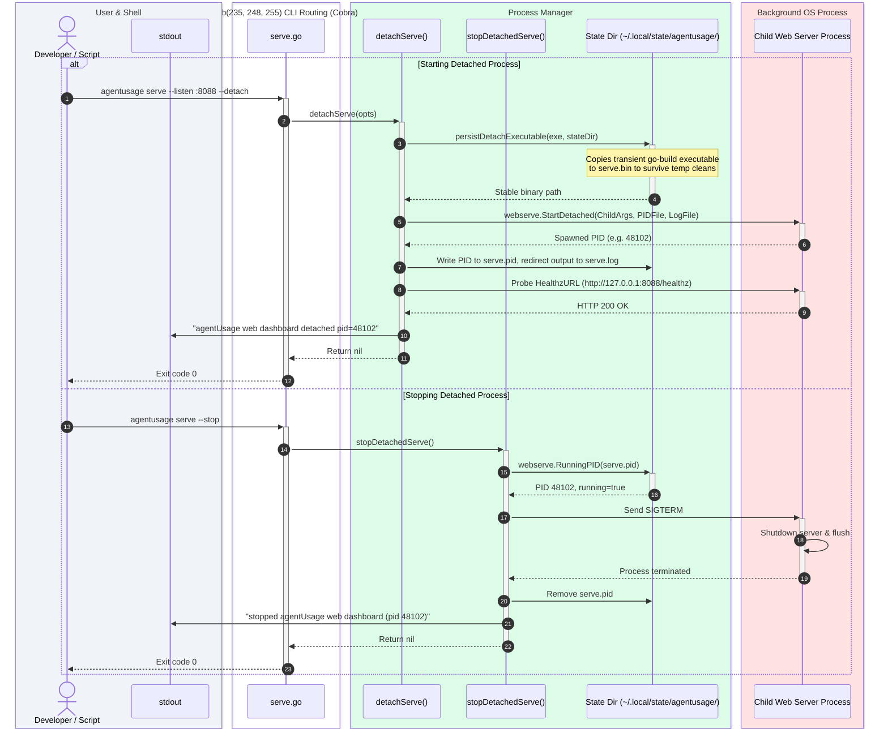
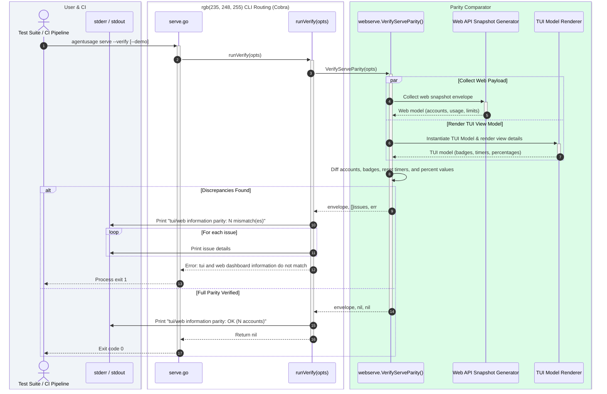
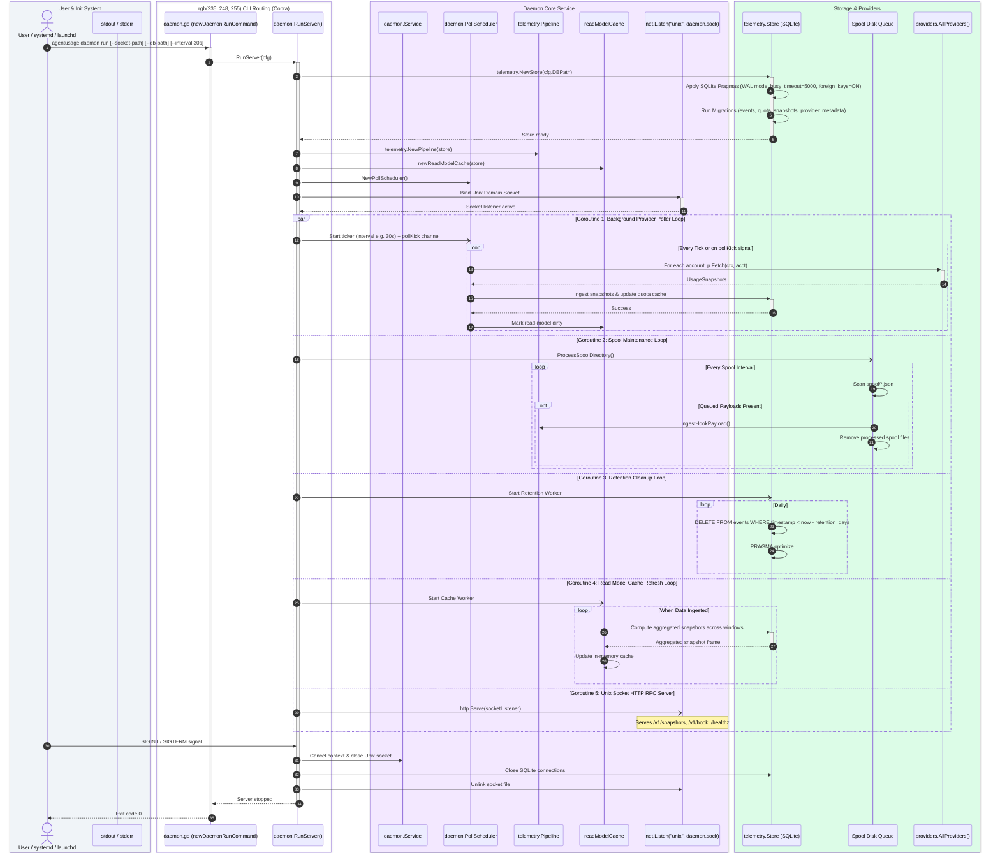
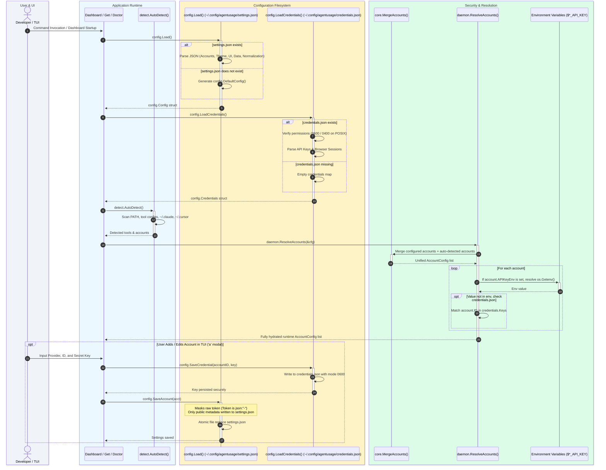
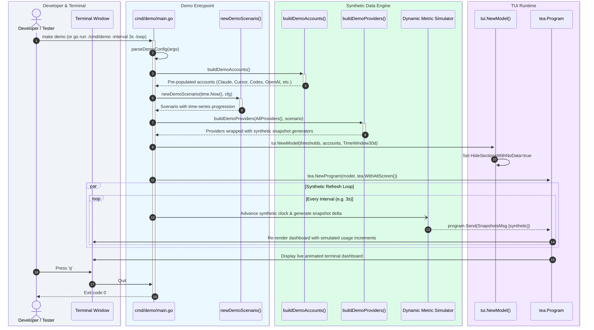

<p align="center">
  
</p>

<p align="center"><strong>terminal-first local quota and usage tracking for AI coding agents, IDEs, and LLM APIs.</strong></p>

---

agentUsage is a terminal-first local dashboard for monitoring AI coding tool usage, spend, quotas, and rate limits across coding agents, IDEs, and LLM APIs. It auto-detects installed tools and API keys on your workstation with zero configuration required.


## Table of Contents

- [Installation](#installation)
- [Command Architecture & Swimlane Flows](#command-architecture--swimlane-flows)
  - [Chapter 1: Interactive Terminal Dashboard (`agentusage`)](#chapter-1-interactive-terminal-dashboard-agentusage)
  - [Chapter 2: Query Provider Quota & Usage (`agentusage get`)](#chapter-2-query-provider-quota--usage-agentusage-get)
  - [Chapter 3: Account & Provider Discovery (`agentusage list`)](#chapter-3-account--provider-discovery-agentusage-list)
  - [Chapter 4: Workstation Credential Auto-Detection (`agentusage detect`)](#chapter-4-workstation-credential-auto-detection-agentusage-detect)
  - [Chapter 5: System & Environment Diagnostics (`agentusage doctor`)](#chapter-5-system--environment-diagnostics-agentusage-doctor)
  - [Chapter 6: Web Dashboard Server (`agentusage serve`)](#chapter-6-web-dashboard-server-agentusage-serve)
  - [Chapter 7: Background Telemetry Daemon (`agentusage daemon`)](#chapter-7-background-telemetry-daemon-agentusage-daemon)
  - [Chapter 8: Configuration & Credential Architecture (`config` Lifecycle)](#chapter-8-configuration--credential-architecture-config-lifecycle)
  - [Chapter 9: Synthetic Simulation & Demo Runner (`make demo`)](#chapter-9-synthetic-simulation--demo-runner-make-demo)
- [Docker](#docker)
- [Supported Providers](#supported-providers)
- [Development & Make Commands](#development--make-commands)
- [License](#license)

## Installation

### macOS (Homebrew)

```bash
brew install nurulislamz/tap/agentusage
```

### Quick install script (Linux & macOS)

```bash
curl -fsSL https://github.com/nurulislamz/agentusage/releases/latest/download/install.sh | bash
```

### From source (Go 1.25+)

```bash
go install github.com/nurulislamz/agentusage/cmd/agentusage@latest
```

> **Note:** Requires CGO (`CGO_ENABLED=1`) for SQLite storage.

### Quick run

```bash
agentusage
```

## Command Architecture & Swimlane Flows

Every command in agentUsage is documented below with an architectural swimlane sequence diagram illustrating its execution path, components touched, concurrency patterns, and fallback mechanisms.

> Detailed design document available in [`docs/COMMAND_FLOW_DIAGRAMS.md`](./docs/COMMAND_FLOW_DIAGRAMS.md).

### Chapter 1: Interactive Terminal Dashboard (`agentusage`)

Running `agentusage` without subcommands launches the full-screen Bubble Tea TUI dashboard. It connects to the background telemetry daemon via Unix socket, falling back to direct provider polling if the daemon is offline, and runs local tool enrichers asynchronously.



---

### Chapter 2: Query Provider Quota & Usage (`agentusage get`)

`agentusage get <id>` retrieves the quota, remaining allowance, and reset timers for a specific provider account or container box. It defaults to a 5-hour rolling limit window.

```mermaid
sequenceDiagram
    autonumber

    box rgb(240, 244, 248) User & Shell
        actor User as Developer / Script / Tmux
        participant Stdout as stdout / Pipe
    end

    box rgb(235, 248, 255) CLI Routing (Cobra)
        participant Cmd as get.go (newGetCommand)
        participant Runner as get.go (runGet)
    end

    box rgb(254, 243, 199) Config & Auth Layer
        participant Cfg as config.Load()
        participant Accounts as daemon.ResolveAccounts()
    end

    box rgb(220, 252, 231) Core Domain & Adapters
        participant Match as findAccount()
        participant Reg as providers.AllProviders()
        participant Adapter as Provider Adapter (e.g. Claude/OpenAI)
        participant Norm as core.NormalizeUsageSnapshotWithConfig
        participant Builder as buildGetResponse()
    end

    box rgb(254, 226, 226) External Provider API
        participant Remote as Upstream API / Local Files
    end

    User->>+Cmd: agentusage get <id> [--window 5h|weekly|all] [--format json|table|plain] [--timeout 10s]
    Cmd->>+Runner: runGet(stdout, id, opts)
    Runner->>+Cfg: config.Load()
    Cfg-->>-Runner: Config (or DefaultConfig on error)
    
    Runner->>+Accounts: daemon.ResolveAccounts(&cfg)
    Accounts-->>-Runner: Complete account list (configured + auto-detected)
    
    Runner->>+Match: findAccount(accounts, id)
    Note over Match: 1. Exact ID match<br/>2. Exact Provider match<br/>3. Prefix/Substring match
    alt No match or ambiguous multiple matches
        Match-->>Runner: nil, false
        Runner-->>User: Error: unknown account; run 'agentusage list'
    else Unique match found
        Match-->>-Runner: AccountConfig, true
    end

    Runner->>Runner: context.WithTimeout(opts.timeout)
    Runner->>+Reg: fetchAccountSnapshot(ctx, acct, cfg)
    Reg->>+Adapter: Match provider adapter by ID & call Fetch(ctx, acct)
    
    Adapter->>+Remote: HTTP Request with Bearer Token / Read Local Credentials
    Remote-->>-Adapter: Raw Response (Headers, Quota JSON, Usage Stats)
    Adapter-->>-Reg: core.UsageSnapshot
    
    Reg->>+Norm: NormalizeUsageSnapshotWithConfig(snap, cfg.ModelNormalization)
    Norm-->>-Reg: Normalized UsageSnapshot
    Reg-->>-Runner: Return snap

    Runner->>+Builder: buildGetResponse(acct, snap, requestedWindow)
    Note over Builder: Filter metrics matching window (5h, 7d/weekly, session, all).<br/>Calculate used %, remaining %, resets_in countdown.
    Builder-->>-Runner: GetResponse struct

    alt Format == "plain" (or --plain)
        Runner->>Stdout: Print remaining percentage e.g. "85% (resets in 2h30m)"
    else Format == "table"
        Runner->>Stdout: Format tabwriter table (Pool, Window, Used, Limit, Remaining, Resets)
    else Format == "json" (Default)
        Runner->>Stdout: JSON Marshal indented GetResponse
    end
    Runner-->>-Cmd: Return nil
    Cmd-->>-User: Exit code 0
```

---

### Chapter 3: Account & Provider Discovery (`agentusage list`)

`agentusage list` (alias `ls`) inspects configured accounts, auto-detected tools, and container runtime states to print an organized inventory.



---

### Chapter 4: Workstation Credential Auto-Detection (`agentusage detect`)

`agentusage detect` scans `$PATH`, configuration paths (`~/.config`, `~/.claude`, Cursor directories), environment variables, and `credentials.json` without writing anything to disk.



---

### Chapter 5: System & Environment Diagnostics (`agentusage doctor`)

`agentusage doctor` executes health checks across terminal color support, configuration permissions (enforcing `0600` on credentials), daemon service registration, SQLite `PRAGMA integrity_check(1)`, and tmux/Claude Code statuslines.

```mermaid
sequenceDiagram
    autonumber

    box rgb(240, 244, 248) User & Shell
        actor User as Developer / Sysadmin
        participant Stdout as stdout
    end

    box rgb(235, 248, 255) CLI Routing (Cobra)
        participant Cmd as doctor.go (newDoctorCommand)
        participant Doc as runDoctorDiagnostics()
    end

    box rgb(254, 243, 199) Config & Security Auditing
        participant CfgCheck as checkDoctorConfig()
        participant CfgFile as settings.json & credentials.json
    end

    box rgb(243, 232, 255) Daemon & DB Integrity
        participant DaemonCheck as checkDoctorDaemon()
        participant SvcMgr as daemon.NewServiceManager()
        participant Client as daemon.NewClient()
        participant DB as SQLite DB (telemetry.db)
    end

    box rgb(220, 252, 231) Tools, Hooks & Statusline
        participant ToolCheck as checkDoctorToolsAndIntegrations()
        participant TmuxCheck as checkDoctorStatuslineAndTmux()
        participant ClaudeConf as ~/.claude/settings.json
        participant TmuxConf as ~/.tmux.conf
    end

    User->>+Cmd: agentusage doctor [--verbose]
    Cmd->>+Doc: runDoctorDiagnostics(stdout, verbose)
    
    Doc->>Stdout: Print header "agentUsage Doctor"

    rect rgb(245, 247, 250)
        Note over Doc: Check 1: System & Terminal
        Doc->>Doc: Check GOOS, GOARCH, Version, os.Executable()
        Doc->>Doc: Inspect COLORTERM & TERM for 24-bit truecolor support
        Doc->>Stdout: [OK] System: linux/amd64 (v0.x.x)
    end

    rect rgb(254, 243, 199)
        Note over Doc: Check 2: Configuration & Credentials
        Doc->>+CfgCheck: checkDoctorConfig(d)
        CfgCheck->>+CfgFile: Stat & Load settings.json
        CfgFile-->>-CfgCheck: Size, accounts count, theme
        CfgCheck->>+CfgFile: Stat credentials.json
        CfgFile-->>-CfgCheck: File mode & entries
        opt Mode != 0600 and != 0400
            CfgCheck->>Stdout: [WARN] Credentials permissions recommended: 0600
        end
        CfgCheck-->>-Doc: Config healthy
    end

    rect rgb(243, 232, 255)
        Note over Doc: Check 3: Daemon Runtime & SQLite Database
        Doc->>+DaemonCheck: checkDoctorDaemon(d, verbose)
        DaemonCheck->>+SvcMgr: Check IsInstalled()
        SvcMgr-->>-DaemonCheck: Installed (systemd/launchd) or Not Installed
        DaemonCheck->>+Client: HealthInfo(ctx [timeout 1.5s])
        Client-->>-DaemonCheck: Active & Healthy (Version, Socket) or Connection Refused
        DaemonCheck->>+DB: sql.Open("sqlite3", file:telemetry.db?mode=ro)
        DaemonCheck->>+DB: QueryRow("PRAGMA integrity_check(1);")
        DB-->>-DaemonCheck: "ok"
        DB-->>-DaemonCheck: Close
        DaemonCheck-->>-Doc: Daemon & DB healthy
    end

    rect rgb(220, 252, 231)
        Note over Doc: Check 4: Tools & Integrations
        Doc->>+ToolCheck: checkDoctorToolsAndIntegrations(d, verbose)
        ToolCheck->>ToolCheck: detect.AutoDetect() & integrations.MatchDetected()
        ToolCheck->>Stdout: [OK] Detected Tools (X) & Integration Hooks (Y)
        ToolCheck-->>-Doc: Integrations audited
    end

    rect rgb(254, 226, 226)
        Note over Doc: Check 5: Statusline & Tmux
        Doc->>+TmuxCheck: checkDoctorStatuslineAndTmux(d)
        TmuxCheck->>+ClaudeConf: Check for "agentusage statusline"
        ClaudeConf-->>-TmuxCheck: Configured / Not configured
        TmuxCheck->>+TmuxConf: Check for "agentusage tmux" segment
        TmuxConf-->>-TmuxCheck: Configured / Not configured
        TmuxCheck-->>-Doc: Statusline audited
    end

    Doc->>Stdout: Result Summary: All systems healthy (N checks passed)
    Doc-->>-Cmd: Return nil
    Cmd-->>-User: Exit code 0
```

---

### Chapter 6: Web Dashboard Server (`agentusage serve`)

The `serve` command hosts a browser dashboard and JSON API. It supports three distinct runtime modes: foreground server, background detached process, and TUI/web visual parity validation.

#### 6.1 Foreground Web Server



#### 6.2 Background Detached Service (`--detach` / `--stop`)



#### 6.3 TUI/Web Parity Verification (`--verify`)



---

### Chapter 7: Background Telemetry Daemon (`agentusage daemon`)

The daemon subsystem coordinates continuous polling, SQLite event storage, deduplication, and hook ingestion from agent tools.

#### 7.1 Daemon Server Poller (`daemon run`)



#### 7.2 Daemon Status & Socket Health (`daemon status`)

```mermaid
sequenceDiagram
    autonumber

    box rgb(240, 244, 248) User & Shell
        actor User as Developer / Script
        participant Stdout as stdout
    end

    box rgb(235, 248, 255) CLI Routing (Cobra)
        participant Cmd as daemon.go (newDaemonStatusCommand)
        participant Status as daemon.ServiceStatus()
    end

    box rgb(254, 226, 226) OS Service Manager
        participant Mgr as daemon.NewServiceManager()
        participant OS as systemctl --user / launchctl
    end

    box rgb(243, 232, 255) Telemetry Daemon
        participant Client as daemon.NewClient(socketPath)
        participant Sock as Unix Socket (/tmp/agentusage.sock)
    end

    User->>+Cmd: agentusage daemon status [--details]
    Cmd->>+Status: ServiceStatus(ctx, socketPath, details)
    
    Status->>+Mgr: Check service installation & state
    Mgr->>+OS: Query systemctl is-active agentusage.service
    OS-->>-Mgr: Status (active / inactive / not-installed)
    Mgr-->>-Status: Service state string

    Status->>+Client: HealthInfo(ctx)
    Client->>+Sock: HTTP GET /healthz
    alt Daemon Responding
        Sock-->>Client: 200 OK JSON { version, uptime, collectors, memory }
        Client-->>-Status: Health struct
        Status->>Stdout: "Daemon Runtime: running (pid: 1234, uptime: 4h12m)"
        Status->>Stdout: "Service: installed and active"
        Status->>Stdout: "Socket: /path/to/agentusage.sock"
        Status->>Stdout: "Version: v0.x.x, Database: healthy"
    else Daemon Unreachable
        Sock-->>Client: Connection Refused / File Not Found
        Client-->>-Status: Error
        Status->>Stdout: "Daemon Runtime: not running (offline)"
        opt Service is installed
            Status->>Stdout: "Service is installed but socket is not answering"
        end
    end

    Status-->>-Cmd: Return nil
    Cmd-->>-User: Exit code 0
```

#### 7.3 Service Lifecycle Management (`daemon install` / `uninstall`)

```mermaid
sequenceDiagram
    autonumber

    box rgb(240, 244, 248) User & Shell
        actor User as Developer / Admin
        participant Stdout as stdout
    end

    box rgb(235, 248, 255) CLI Routing (Cobra)
        participant Cmd as daemon.go (newDaemonInstallCommand)
        participant Svc as daemon.InstallService() / UninstallService()
    end

    box rgb(220, 252, 231) Service Manager Adapter
        participant Mgr as daemon.NewServiceManager()
    end

    box rgb(254, 226, 226) Host Operating System
        participant UnitFile as Systemd Unit / Launchd Plist
        participant InitSystem as systemctl --user / launchctl
    end

    alt Install Service
        User->>+Cmd: agentusage daemon install
        Cmd->>+Svc: InstallService(socketPath)
        Svc->>+Mgr: Generate service configuration
        opt Linux
            Mgr->>UnitFile: Write ~/.config/systemd/user/agentusage.service
            Mgr->>InitSystem: exec("systemctl", "--user", "daemon-reload")
            Mgr->>InitSystem: exec("systemctl", "--user", "enable", "--now", "agentusage.service")
        else macOS
            Mgr->>UnitFile: Write ~/Library/LaunchAgents/com.nurulislamz.agentusage.plist
            Mgr->>InitSystem: exec("launchctl", "load", plistPath)
        end
        Mgr-->>-Svc: Success
        Svc->>Stdout: "telemetry daemon service installed"
        Svc-->>-Cmd: Return nil
        Cmd-->>-User: Exit code 0
    else Uninstall Service
        User->>+Cmd: agentusage daemon uninstall
        Cmd->>+Svc: UninstallService(socketPath)
        Svc->>+Mgr: Teardown service
        opt Linux
            Mgr->>InitSystem: exec("systemctl", "--user", "disable", "--now", "agentusage.service")
            Mgr->>UnitFile: Remove unit file
            Mgr->>InitSystem: exec("systemctl", "--user", "daemon-reload")
        else macOS
            Mgr->>InitSystem: exec("launchctl", "unload", plistPath)
            Mgr->>UnitFile: Remove plist file
        end
        Mgr-->>-Svc: Success
        Svc->>Stdout: "telemetry daemon service uninstalled"
        Svc-->>-Cmd: Return nil
        Cmd-->>-User: Exit code 0
    end
```

#### 7.4 Telemetry Hook Ingestion & Spool Fallback (`daemon hook`)

```mermaid
sequenceDiagram
    autonumber

    box rgb(240, 244, 248) External Tool & Stdin
        actor Agent as Coding Agent (Claude / OpenCode / Codex)
        participant Stdin as Stdin / Argv
    end

    box rgb(235, 248, 255) CLI Routing (Cobra)
        participant Cmd as daemon.go (newDaemonHookCommand)
    end

    box rgb(243, 232, 255) Daemon Unix Socket (Fast Path)
        participant Client as daemon.NewClient()
        participant DaemonSock as Unix Socket (daemon.sock)
        participant Pipe as daemon.Pipeline
    end

    box rgb(220, 252, 231) Local Fallback & Spool (Safe Path)
        participant Local as daemon.IngestHookLocally()
        participant Spool as Spool File (~/.local/state/.../spool/)
        participant DB as Local SQLite Store (telemetry.db)
    end

    Agent->>+Cmd: agentusage daemon hook opencode < payload.json<br/>(or payload passed as second argument)
    Cmd->>+Stdin: Read hook payload bytes
    Stdin-->>-Cmd: Raw JSON bytes

    alt --spool-only flag set
        Cmd->>+Local: IngestHookLocally(..., spoolOnly=true)
        Local->>+Spool: Write timestamped payload JSON
        Spool-->>-Local: File saved
        Local-->>-Cmd: Enqueued=1, Ingested=0
        Cmd-->>Agent: Enqueued to local spool
    else Default Path: Try Daemon Socket First
        Cmd->>+Client: IngestHook(ctx, sourceName, accountID, payload)
        Client->>+DaemonSock: HTTP POST /v1/hook
        alt Daemon is Online & Responding
            DaemonSock->>+Pipe: IngestHookPayload(source, account, payload)
            Pipe->>Pipe: Validate payload & extract tokens
            Pipe->>Pipe: Deduplicate Event ID against cache
            Pipe->>+DB: Insert into telemetry events table
            DB-->>-Pipe: Commit OK
            Pipe-->>-DaemonSock: IngestResult { enqueued, processed, ingested, deduped }
            DaemonSock-->>-Client: 200 OK IngestResult
            Client-->>-Cmd: Success
            opt Verbose enabled
                Cmd->>Agent: Print ingest stats
            end
        else Daemon Offline / Socket Error
            DaemonSock-->>Client: Connection Refused / Timeout
            Client-->>-Cmd: Daemon Error
            
            Note over Cmd,Local: Automatic Graceful Fallback
            Cmd->>+Local: IngestHookLocally(ctx, source, acct, payload, dbPath, spoolDir)
            alt SQLite DB Accessible
                Local->>+DB: Direct SQLite Open & Insert Event
                DB-->>-Local: Committed
                Local-->>-Cmd: IngestResult { ingested: 1 }
                opt Verbose enabled
                    Cmd->>Agent: Print "via local-fallback" stats
                end
            else DB Locked or Unwritable
                Local->>+Spool: Write to spool directory for deferred daemon recovery
                Spool-->>-Local: Written
                Local-->>-Cmd: IngestResult { enqueued: 1 }
                opt Verbose enabled
                    Cmd->>Agent: Print "enqueued to spool"
                end
            end
        end
    end
    Cmd-->>-Agent: Exit code 0
```

---

### Chapter 8: Configuration & Credential Architecture (`config` Lifecycle)

agentUsage maintains a strict dual-store security model: non-sensitive application settings reside in `settings.json`, while private API keys and browser session cookies are stored in `credentials.json` with strict `0600` filesystem permissions.



---

### Chapter 9: Synthetic Simulation & Demo Runner (`make demo`)

`make demo` (or `go run ./cmd/demo`) executes a 100% synthetic, zero-network scenario replaying realistic usage metrics across all 37 supported providers for interactive testing.



---

## Docker

agentUsage provides multi-stage container images published to GitHub Container Registry (`ghcr.io/nurulislamz/agentusage` and `ghcr.io/nurulislamz/agentusage-hub`).

Images are built with Alpine 3.21, include SQLite CGO support, and run under the unprivileged `agentusage` user (`UID 1000:1000`, `HOME=/home/agentusage`).

### Running the Headless Hub Server

The hub aggregates usage snapshots from multiple worker machines:

```bash
docker run -d \
  --name agentusage-hub \
  -p 9190:9190 \
  -e AGENTUSAGE_HUB_TOKEN="your-secret-token" \
  ghcr.io/nurulislamz/agentusage:latest
```

> **Note:** When binding a public port, set `AGENTUSAGE_HUB_TOKEN` to require Bearer token authentication from worker machines.

### Running the Web Dashboard

Serve the browser-based dashboard in a container by mounting your config and telemetry state volumes:

```bash
docker run -d \
  --name agentusage-web \
  -p 8080:8080 \
  -v ~/.config/agentusage:/home/agentusage/.config/agentusage \
  -v ~/.local/state/agentusage:/home/agentusage/.local/state/agentusage \
  -e AGENTUSAGE_SERVE_TOKEN="your-secret-token" \
  ghcr.io/nurulislamz/agentusage:latest serve --listen :8080 --no-open
```

### Running the Telemetry Daemon in Docker

Run the background SQLite telemetry collector and expose its Unix domain socket or state directory:

```bash
docker run -d \
  --name agentusage-daemon \
  -v ~/.config/agentusage:/home/agentusage/.config/agentusage \
  -v ~/.local/state/agentusage:/home/agentusage/.local/state/agentusage \
  ghcr.io/nurulislamz/agentusage:latest telemetry daemon run
```

### Required Volumes and Paths

| Host Path | Container Path (`$HOME=/home/agentusage`) | Purpose |
|---|---|---|
| `~/.config/agentusage` | `/home/agentusage/.config/agentusage` | Settings (`settings.json`) and secure API credentials (`credentials.json`) |
| `~/.local/state/agentusage` | `/home/agentusage/.local/state/agentusage` | SQLite database (`telemetry.db`) and daemon socket (`daemon.sock`) |

### Building Locally

Build and run Docker images locally with `make`:

```bash
make docker-build        # Build unified agentusage image (agentusage:latest)
make docker-build-hub    # Build dedicated hub image (agentusage-hub:latest)
make docker-run-hub      # Run headless hub on port 9190
make docker-run-serve    # Run web dashboard on port 8080
make docker-run-daemon   # Run telemetry daemon in container
```

### Environment Variables

| Variable | Description |
|---|---|
| `AGENTUSAGE_HUB_TOKEN` | Bearer token for authenticating hub connections and worker pushes |
| `AGENTUSAGE_SERVE_TOKEN` | Bearer token for securing web dashboard access (`agentusage serve`) |
| `AGENTUSAGE_SERVE_BASE_PATH` | URL prefix for serving behind reverse proxies (e.g. `/agentusage`) |
| `AGENTUSAGE_DEBUG` | Set to `1` to enable debug logging |

### CGO and Runtime Architecture

- **CGO Required**: `CGO_ENABLED=1` is enabled in the builder stage with `gcc` and `musl-dev` because `mattn/go-sqlite3` requires CGO for local SQLite telemetry caching and the Cursor provider.
- **Security Hardening**: Runtime containers drop privileges to user `agentusage` (`UID 1000:1000`), include minimal runtime dependencies (`ca-certificates`, `tzdata`, `wget`, `curl`), and include automated healthcheck monitoring.

## Supported Providers

agentUsage supports 37 providers covering coding agents, IDEs, and LLM API platforms. All providers are automatically detected when available.

### Coding Agents & IDEs (24 providers)

| Provider | Detection | What it tracks |
|---|---|---|
| **Claude Code** | `claude` binary + `~/.claude` directory | Daily activity, per-model tokens, 5-hour billing block computation, burn rate, cost estimation |
| **Cursor** | `cursor` binary + local SQLite DBs (`state.vscdb`) | Plan spend and limits, per-model aggregation, Composer sessions, AI code scoring |
| **GitHub Copilot** | `gh` CLI with Copilot extension or `copilot` binary + `~/.copilot` | Chat and completions quota, org billing, session tracking |
| **Codex CLI** | `codex` binary + `~/.codex` directory | Session tokens, per-model and per-client breakdown, credits, rate limits |
| **Gemini CLI** | `gemini` binary + `~/.gemini` directory | OAuth status, conversation count, per-model tokens, quota API |
| **Antigravity CLI** | `agy` binary + `~/.gemini/antigravity-cli` (or `~/.agy-containers/<box>/...`) | Live quota buckets, session tokens, model quotas, OAuth token refresh |
| **OpenCode** | `OPENCODE_API_KEY` / `ZEN_API_KEY` or `~/.local/share/opencode/auth.json` | Credits, activity, generation stats, Zen models + balance, monthly limit, subscription |
| **Ollama** | `OLLAMA_HOST` env var or `ollama` binary | Local server models, per-model usage, optional cloud billing |
| **Amp** | `amp` binary + `~/.amp` directory | Session tokens, per-turn usage and costs |
| **Goose** | `goose` binary + `~/.config/goose` (or `~/.local/share/goose`) | Session tokens, model breakdowns, local logs |
| **Hermes Agent** | `hermes` binary + `~/.hermes` directory | Conversation logs, session tokens, cost estimation |
| **Mux** | `mux` binary + `~/.mux` directory | Multiplexed sessions, turn usage, token counts |
| **Droid** | `droid` binary + `~/.factory` directory | Droid sessions, model tokens, activity |
| **Crush** | `crush` binary + `~/.crush` directory | Charm Crush agent sessions, per-model token usage |
| **Roo Code** | Roo Code VS Code extension storage | Session tokens, model costs, workspace activity |
| **Kilo Code** | `~/.kilocode` directory or storage | Kilo Code sessions, token usage, cost tracking |
| **Kiro** | `kiro` binary + `~/.kiro` directory | Kiro sessions, model usage, turn metrics |
| **Zed** | `zed` binary + `~/.config/zed` directory | Zed assistant/agent session tokens, model usage |
| **Codebuff** | `codebuff` binary + `~/.codebuff` directory | Codebuff generation tokens, sessions, cost estimation |
| **Kimi CLI** | `kimi` binary + `~/.kimi` directory | Kimi CLI session tokens, model breakdown |
| **OpenClaw** | `openclaw` binary + `~/.openclaw` directory | OpenClaw session tokens, workspace metrics |
| **Pi** | `pi` binary + `~/.pi` directory | Pi coding agent session tokens, turn metrics |
| **Qwen CLI** | `qwen` binary + `~/.qwen` directory | Qwen CLI session tokens, model usage |
| **Command Code** | `command-code` binary + `~/.command-code` directory | Command Code session logs, token usage, cost tracking |

### API Platforms (13 providers)

| Provider | Detection | What it tracks |
|---|---|---|
| **OpenAI** | `OPENAI_API_KEY` environment variable | Rate limits via lightweight header probing |
| **Anthropic** | `ANTHROPIC_API_KEY` environment variable | Rate limits via lightweight header probing |
| **Azure OpenAI** | `AZURE_OPENAI_API_KEY` or `AZURE_API_KEY` + `AZURE_RESOURCE_NAME` (or `AZURE_OPENAI_ENDPOINT`) | Rate limits via lightweight header probing on the resource endpoint |
| **Alibaba Cloud** | `ALIBABA_CLOUD_API_KEY` or `DASHSCOPE_API_KEY` | Quotas, credits, daily usage, per-model tracking (DashScope) |
| **OpenRouter** | `OPENROUTER_API_KEY` environment variable | Credits, activity, generation stats, per-model breakdown across endpoints |
| **Perplexity** | Browser session at `console.perplexity.ai` | Tier (0–5), available balance, lifetime spend, auto-reload settings, payment method, 30-day analytics |
| **Groq** | `GROQ_API_KEY` environment variable | Rate limits, daily usage windows |
| **Mistral AI** | `MISTRAL_API_KEY` environment variable | Subscription info, usage endpoints |
| **Moonshot** | `MOONSHOT_API_KEY` environment variable | Balance breakdown (cash + voucher), org limits, tier; supports `api.moonshot.ai` and `api.moonshot.cn` |
| **DeepSeek** | `DEEPSEEK_API_KEY` environment variable | Rate limits, account balance |
| **xAI** | `XAI_API_KEY` environment variable | Rate limits, API key info |
| **Z.AI** | `ZAI_API_KEY` / `ZHIPUAI_API_KEY` or `~/.chelper/config.yaml` | Coding plan quotas, model/tool usage, daily trends, credit balance |
| **Gemini API** | `GEMINI_API_KEY` or `GOOGLE_API_KEY` | Rate limits, per-model limits |

## Development & Make Commands

```bash
make build          # Build binary to ./bin/agentusage
make run            # Run the application locally
make test           # Run unit tests with coverage
make test-verbose   # Run unit tests with verbose output
make lint           # Run linter (golangci-lint)
make vet            # Run go vet
make fmt            # Format Go source code
make deps           # Download and verify Go dependencies
make tidy           # Tidy Go module dependencies
make demo           # Build and run demo dashboard with simulated data
make serve          # Run local web dashboard
make docker-build   # Build Docker image for agentusage
make docker-run-hub # Run headless hub container
make install        # Install binary to ~/.local/bin and configure daemon service
make uninstall      # Uninstall binary from ~/.local/bin and remove daemon service
```

## License

[MIT](LICENSE)
