# agentUsage: Command Flow Architecture & Swimlane Diagrams

This document provides complete, high-fidelity **Swimlane Sequence Diagrams** and architectural flows for every command and subsystem in `agentusage`.

---

## 1. Tool Selection Rationale & Documentation

As required, we evaluated the standard technical diagramming engines:

| Criterion | **PlantUML** (Selected Standard) | **Mermaid** | **Graphviz (DOT)** |
|---|---|---|---|
| **Sequence Diagram Expressiveness** | **Optimal** — native `box` tiers, explicit lifelines (`++`/`--`), multi-branch `par`/`else`, robust note placement, and skinparam formatting. | Good, but sensitive to unescaped special characters (`<`, `>`, `:`, spaces in box colors) which fail to render. | Poor — not designed for sequence causality or swimlanes. |
| **Markdown Rendering Reliability** | **100% Reliable** — pre-rendered SVG assets in `docs/diagrams/*.svg` render natively across GitHub, GitLab, VS Code, JetBrains, Obsidian, and web viewers without external dependencies. | Unreliable — syntax errors in complex sequence diagrams break entire page rendering. | Requires image build step (`dot -Tsvg`). |
| **Swimlane Capabilities** | **Native `box` groupings** in sequence diagrams with custom hexadecimal colors representing architectural tiers. | `box` in sequence diagrams (fragile syntax); nested `subgraph` in flowcharts. | Cluster subgraphs (`subgraph cluster_*`). |
| **Portability & Verification** | Plain text source embedded alongside vector SVGs. Tested in CI with automated syntax and XML validation. | Plain text, but dependent on client-side JS parser versions. | Heavy local binary requirement. |

### Architectural Swimlanes Defined Across Diagrams

Each diagram uses consistent, color-coded visual swimlanes:
- ■ **User & Terminal Layer** (`#F0F4F8`): Developer, CLI stdin/stdout, and TTY devices.
- ■ **CLI & Routing (Cobra)** (`#EBF8FF`): Command entrypoints, flag parsers, and validation handlers.
- ■ **Config & Auth Layer** (`#FEF3C7`): `settings.json`, secure `credentials.json` (0600), and auto-detectors.
- ■ **Core Domain & Providers** (`#DCFCE7`): Provider adapters (37 providers), snapshot normalizers, and enrichers.
- ■ **Daemon & Telemetry Store** (`#F3E8FF`): ViewRuntime, Unix domain socket, SQLite store, and spool engine.
- ■ **External Runtimes & OS** (`#FEE2E2`): Remote AI provider APIs, OS service managers (systemd/launchd), and browsers.

---

## 2. Command Index

1. [`agentusage` (Root / Interactive TUI Dashboard)](#3-agentusage-root--interactive-terminal-dashboard)
2. [`agentusage get <id>`](#4-agentusage-get-id)
3. [`agentusage list` (alias `ls`)](#5-agentusage-list-alias-ls)
4. [`agentusage detect`](#6-agentusage-detect)
5. [`agentusage doctor`](#7-agentusage-doctor)
6. [`agentusage serve` (Web Dashboard Server)](#8-agentusage-serve-web-dashboard-server)
   - 6.1 Foreground Server Mode
   - 6.2 Detached Daemon & Stop Mode (`--detach` / `--stop`)
   - 6.3 TUI/Web Parity Verification Mode (`--verify`)
7. [`agentusage daemon`](#9-agentusage-daemon)
   - 7.1 `daemon run` (Foreground Poller & Ingestion Engine)
   - 7.2 `daemon status` (Runtime & Socket Health Inspection)
   - 7.3 `daemon install` & `uninstall` (Service Lifecycle Management)
   - 7.4 `daemon hook <source> [payload]` (Telemetry Ingest & Local Fallback)
8. [Configuration & Credential Architecture (`config` Lifecycle)](#10-configuration--credential-architecture-config-lifecycle)
9. [Demo Replay Runner (`cmd/demo`)](#11-demo-simulation-flow-agentusage-demo)
10. [Summary Table of Commands & Architecture Interfaces](#12-summary-table-of-commands--architecture-interfaces)

---

## 3. `agentusage` (Root / Interactive Terminal Dashboard)

When executed without subcommands, `agentusage` launches the Bubble Tea full-screen terminal interface. It binds a background broadcaster to the telemetry daemon socket, automatically falling back to direct provider polling when the daemon is offline, and runs asynchronous enrichment for local tools (Cursor, Antigravity, OpenCode).

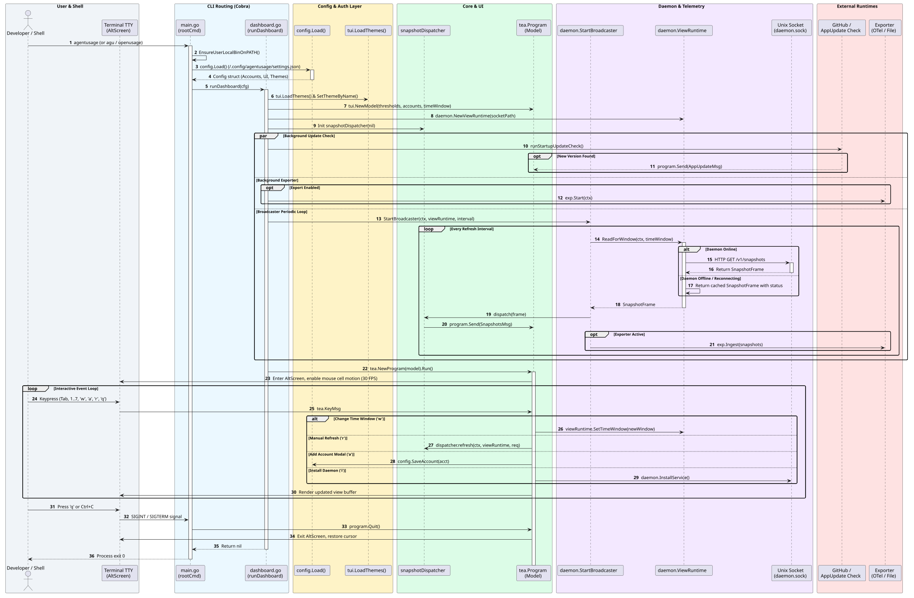

View PlantUML Source

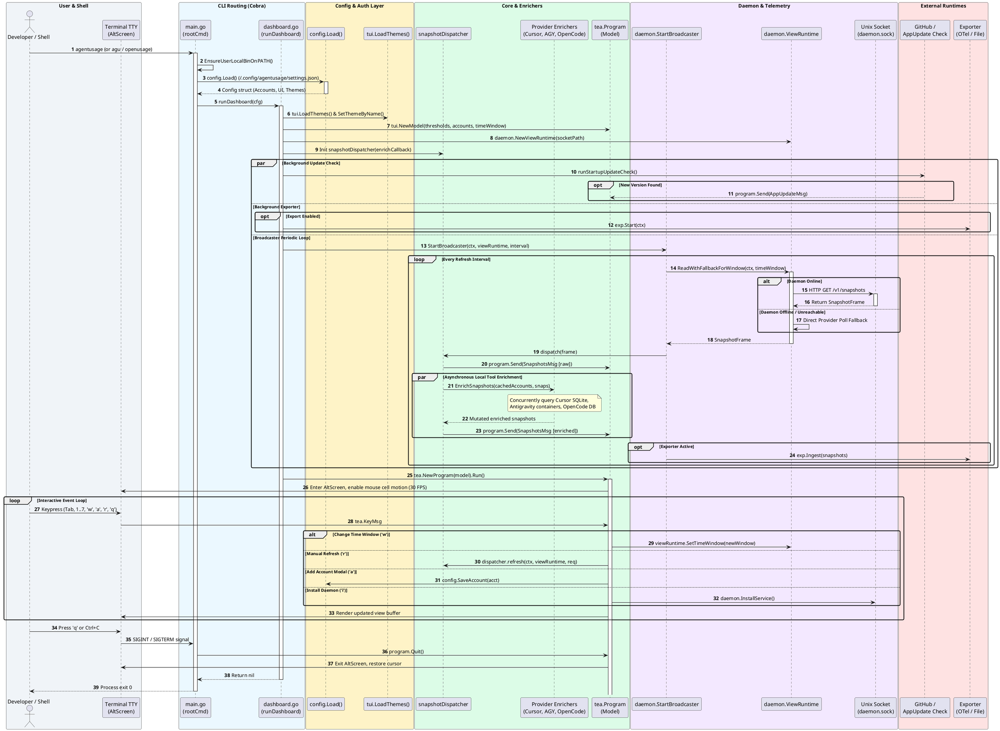
```plantuml
@startuml
autonumber
skinparam roundcorner 6
skinparam sequenceMessageAlign center
skinparam defaultFontName sans-serif

box "User & Shell" #F0F4F8
    actor User as "Developer / Shell"
    participant TTY as "Terminal TTY\n(AltScreen)"
end box

box "CLI Routing (Cobra)" #EBF8FF
    participant Main as "main.go\n(rootCmd)"
    participant Dash as "dashboard.go\n(runDashboard)"
end box

box "Config & Auth Layer" #FEF3C7
    participant Cfg as "config.Load()"
    participant Theme as "tui.LoadThemes()"
end box

box "Core & Enrichers" #DCFCE7
    participant Disp as "snapshotDispatcher"
    participant Enrich as "Provider Enrichers\n(Cursor, AGY, OpenCode)"
    participant Tea as "tea.Program\n(Model)"
end box

box "Daemon & Telemetry" #F3E8FF
    participant Bcast as "daemon.StartBroadcaster"
    participant ViewRT as "daemon.ViewRuntime"
    participant Sock as "Unix Socket\n(daemon.sock)"
end box

box "External Runtimes" #FEE2E2
    participant Update as "GitHub /\nAppUpdate Check"
    participant Exporter as "Exporter\n(OTel / File)"
end box

User -> Main ++ : agentusage (or agu / openusage)
Main -> Main : EnsureUserLocalBinOnPATH()
Main -> Cfg ++ : config.Load() (~/.config/agentusage/settings.json)
Cfg --> Main -- : Config struct (Accounts, UI, Themes)
Main -> Dash ++ : runDashboard(cfg)
Dash -> Theme : tui.LoadThemes() & SetThemeByName()
Dash -> Tea : tui.NewModel(thresholds, accounts, timeWindow)
Dash -> ViewRT : daemon.NewViewRuntime(socketPath)
Dash -> Disp : Init snapshotDispatcher(enrichCallback)

par Background Update Check
    Dash -> Update : runStartupUpdateCheck()
    opt New Version Found
        Update --> Tea : program.Send(AppUpdateMsg)
    end
else Background Exporter
    opt Export Enabled
        Dash -> Exporter : exp.Start(ctx)
    end
else Broadcaster Periodic Loop
    Dash -> Bcast : StartBroadcaster(ctx, viewRuntime, interval)
    loop Every Refresh Interval
        Bcast -> ViewRT ++ : ReadWithFallbackForWindow(ctx, timeWindow)
        alt Daemon Online
            ViewRT -> Sock ++ : HTTP GET /v1/snapshots
            Sock --> ViewRT -- : Return SnapshotFrame
        else Daemon Offline / Unreachable
            ViewRT -> ViewRT : Direct Provider Poll Fallback
        end
        ViewRT --> Bcast -- : SnapshotFrame
        Bcast -> Disp : dispatch(frame)
        Disp -> Tea : program.Send(SnapshotsMsg [raw])
        
        par Asynchronous Local Tool Enrichment
            Disp -> Enrich : EnrichSnapshots(cachedAccounts, snaps)
            note over Enrich : Concurrently query Cursor SQLite,\nAntigravity containers, OpenCode DB
            Enrich --> Disp : Mutated enriched snapshots
            Disp -> Tea : program.Send(SnapshotsMsg [enriched])
        end

        opt Exporter Active
            Bcast -> Exporter : exp.Ingest(snapshots)
        end
    end
end

Dash -> Tea ++ : tea.NewProgram(model).Run()
Tea -> TTY : Enter AltScreen, enable mouse cell motion (30 FPS)

loop Interactive Event Loop
    User -> TTY : Keypress (Tab, 1..7, 'w', 'a', 'r', 'q')
    TTY -> Tea : tea.KeyMsg
    alt Change Time Window ('w')
        Tea -> ViewRT : viewRuntime.SetTimeWindow(newWindow)
    else Manual Refresh ('r')
        Tea -> Disp : dispatcher.refresh(ctx, viewRuntime, req)
    else Add Account Modal ('a')
        Tea -> Cfg : config.SaveAccount(acct)
    else Install Daemon ('i')
        Tea -> Sock : daemon.InstallService()
    end
    Tea -> TTY : Render updated view buffer
end

User -> TTY : Press 'q' or Ctrl+C
TTY -> Main : SIGINT / SIGTERM signal
Main -> Tea : program.Quit()
Tea -> TTY : Exit AltScreen, restore cursor
Dash --> Main -- : Return nil
Main --> User -- : Process exit 0
@enduml
```

---

## 4. `agentusage get <id>`

The `get` command queries quota and usage for a specific provider account or box. It defaults to a 5-hour rolling limit window, with flags for JSON, plain percentage, or table formatting.

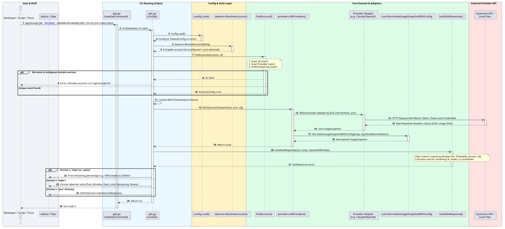

View PlantUML Source

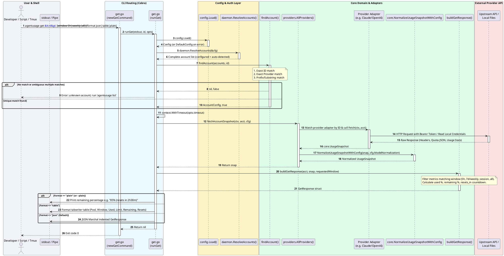
```plantuml
@startuml
autonumber
skinparam roundcorner 6
skinparam sequenceMessageAlign center
skinparam defaultFontName sans-serif

box "User & Shell" #F0F4F8
    actor User as "Developer / Script / Tmux"
    participant Stdout as "stdout / Pipe"
end box

box "CLI Routing (Cobra)" #EBF8FF
    participant Cmd as "get.go\n(newGetCommand)"
    participant Runner as "get.go\n(runGet)"
end box

box "Config & Auth Layer" #FEF3C7
    participant Cfg as "config.Load()"
    participant Accounts as "daemon.ResolveAccounts()"
end box

box "Core Domain & Adapters" #DCFCE7
    participant Match as "findAccount()"
    participant Reg as "providers.AllProviders()"
    participant Adapter as "Provider Adapter\n(e.g. Claude/OpenAI)"
    participant Norm as "core.NormalizeUsageSnapshotWithConfig"
    participant Builder as "buildGetResponse()"
end box

box "External Provider API" #FEE2E2
    participant Remote as "Upstream API /\nLocal Files"
end box

User -> Cmd ++ : agentusage get <font color=blue>&lt;id&gt;</font> [--window 5h|weekly|all] [--format json|table|plain]
Cmd -> Runner ++ : runGet(stdout, id, opts)
Runner -> Cfg ++ : config.Load()
Cfg --> Runner -- : Config (or DefaultConfig on error)

Runner -> Accounts ++ : daemon.ResolveAccounts(&cfg)
Accounts --> Runner -- : Complete account list (configured + auto-detected)

Runner -> Match ++ : findAccount(accounts, id)
note over Match: 1. Exact ID match\n2. Exact Provider match\n3. Prefix/Substring match
alt No match or ambiguous multiple matches
    Match --> Runner : nil, false
    Runner --> User : Error: unknown account; run 'agentusage list'
else Unique match found
    Match --> Runner -- : AccountConfig, true
end

Runner -> Runner : context.WithTimeout(opts.timeout)
Runner -> Reg ++ : fetchAccountSnapshot(ctx, acct, cfg)
Reg -> Adapter ++ : Match provider adapter by ID & call Fetch(ctx, acct)

Adapter -> Remote ++ : HTTP Request with Bearer Token / Read Local Credentials
Remote --> Adapter -- : Raw Response (Headers, Quota JSON, Usage Stats)
Adapter --> Reg -- : core.UsageSnapshot

Reg -> Norm ++ : NormalizeUsageSnapshotWithConfig(snap, cfg.ModelNormalization)
Norm --> Reg -- : Normalized UsageSnapshot
Reg --> Runner -- : Return snap

Runner -> Builder ++ : buildGetResponse(acct, snap, requestedWindow)
note over Builder: Filter metrics matching window (5h, 7d/weekly, session, all).\nCalculate used %, remaining %, resets_in countdown.
Builder --> Runner -- : GetResponse struct

alt Format == "plain" (or --plain)
    Runner -> Stdout : Print remaining percentage e.g. "85% (resets in 2h30m)"
else Format == "table"
    Runner -> Stdout : Format tabwriter table (Pool, Window, Used, Limit, Remaining, Resets)
else Format == "json" (Default)
    Runner -> Stdout : JSON Marshal indented GetResponse
end
Runner --> Cmd -- : Return nil
Cmd --> User -- : Exit code 0
@enduml
```

---

## 5. `agentusage list` (alias `ls`)

The `list` command inspects both user-configured accounts and workstation auto-detected accounts, determines runtime status (including Antigravity container health), and outputs a table, JSON, or raw IDs.

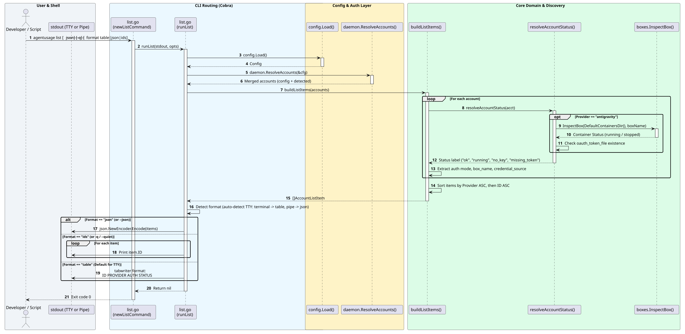

View PlantUML Source

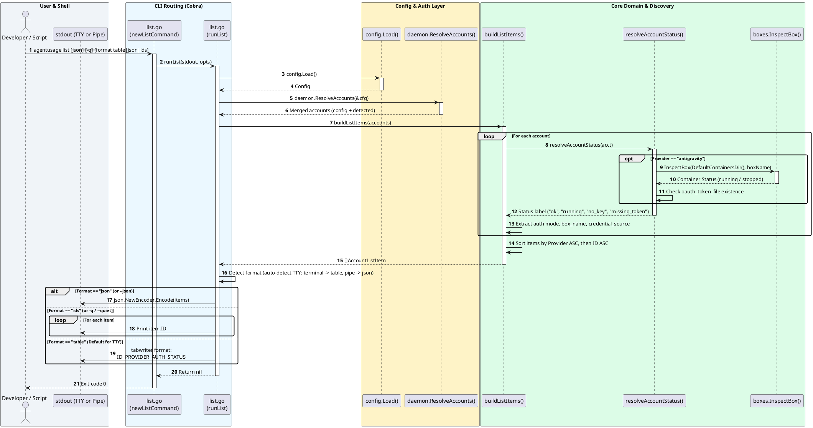
```plantuml
@startuml
autonumber
skinparam roundcorner 6
skinparam sequenceMessageAlign center
skinparam defaultFontName sans-serif

box "User & Shell" #F0F4F8
    actor User as "Developer / Script"
    participant Stdout as "stdout (TTY or Pipe)"
end box

box "CLI Routing (Cobra)" #EBF8FF
    participant Cmd as "list.go\n(newListCommand)"
    participant Runner as "list.go\n(runList)"
end box

box "Config & Auth Layer" #FEF3C7
    participant Cfg as "config.Load()"
    participant Resolver as "daemon.ResolveAccounts()"
end box

box "Core Domain & Discovery" #DCFCE7
    participant Builder as "buildListItems()"
    participant Status as "resolveAccountStatus()"
    participant Boxes as "boxes.InspectBox()"
end box

User -> Cmd ++ : agentusage list [--json] [-q] [--format table|json|ids]
Cmd -> Runner ++ : runList(stdout, opts)
Runner -> Cfg ++ : config.Load()
Cfg --> Runner -- : Config

Runner -> Resolver ++ : daemon.ResolveAccounts(&cfg)
Resolver --> Runner -- : Merged accounts (config + detected)

Runner -> Builder ++ : buildListItems(accounts)
loop For each account
    Builder -> Status ++ : resolveAccountStatus(acct)
    opt Provider == "antigravity"
        Status -> Boxes ++ : InspectBox(DefaultContainersDir(), boxName)
        Boxes --> Status -- : Container Status (running / stopped)
        Status -> Status : Check oauth_token_file existence
    end
    Status --> Builder -- : Status label ("ok", "running", "no_key", "missing_token")
    Builder -> Builder : Extract auth mode, box_name, credential_source
end
Builder -> Builder : Sort items by Provider ASC, then ID ASC
Builder --> Runner -- : []AccountListItem

Runner -> Runner : Detect format (auto-detect TTY: terminal -> table, pipe -> json)

alt Format == "json" (or --json)
    Runner -> Stdout : json.NewEncoder.Encode(items)
else Format == "ids" (or -q / --quiet)
    loop For each item
        Runner -> Stdout : Print item.ID
    end
else Format == "table" (Default for TTY)
    Runner -> Stdout : tabwriter format:\nID  PROVIDER  AUTH  STATUS
end

Runner --> Cmd -- : Return nil
Cmd --> User -- : Exit code 0
@enduml
```

---

## 6. `agentusage detect`

`detect` runs the workstation credential auto-discovery pipeline, scanning local directories, executables in `$PATH`, environment variables, and the secure `credentials.json` file. It outputs a masked report with zero writes to disk.

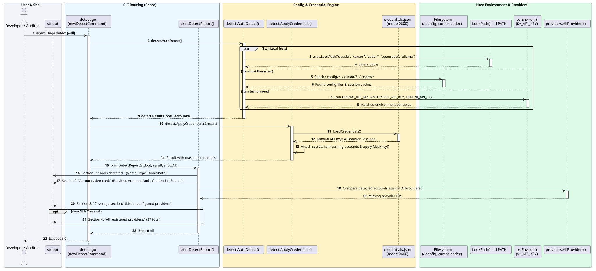

View PlantUML Source

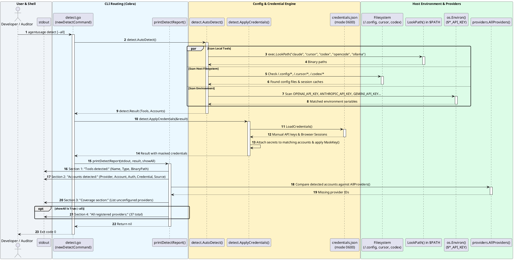
```plantuml
@startuml
autonumber
skinparam roundcorner 6
skinparam sequenceMessageAlign center
skinparam defaultFontName sans-serif

box "User & Shell" #F0F4F8
    actor User as "Developer / Auditor"
    participant Stdout as "stdout"
end box

box "CLI Routing (Cobra)" #EBF8FF
    participant Cmd as "detect.go\n(newDetectCommand)"
    participant Report as "printDetectReport()"
end box

box "Config & Credential Engine" #FEF3C7
    participant Auto as "detect.AutoDetect()"
    participant Creds as "detect.ApplyCredentials()"
    participant SecretStore as "credentials.json\n(mode 0600)"
end box

box "Host Environment & Providers" #DCFCE7
    participant FS as "Filesystem\n(~/.config, cursor, codex)"
    participant PATH as "LookPath() in $PATH"
    participant Env as "os.Environ()\n($*_API_KEY)"
    participant Reg as "providers.AllProviders()"
end box

User -> Cmd ++ : agentusage detect [--all]
Cmd -> Auto ++ : detect.AutoDetect()

par Scan Local Tools
    Auto -> PATH ++ : exec.LookPath("claude", "cursor", "codex", "opencode", "ollama")
    PATH --> Auto -- : Binary paths
else Scan Host Filesystem
    Auto -> FS ++ : Check ~/.config/*, ~/.cursor/*, ~/.codex/*
    FS --> Auto -- : Found config files & session caches
else Scan Environment
    Auto -> Env ++ : Scan OPENAI_API_KEY, ANTHROPIC_API_KEY, GEMINI_API_KEY...
    Env --> Auto -- : Matched environment variables
end
Auto --> Cmd -- : detect.Result (Tools, Accounts)

Cmd -> Creds ++ : detect.ApplyCredentials(&result)
Creds -> SecretStore ++ : LoadCredentials()
SecretStore --> Creds -- : Manual API keys & Browser Sessions
Creds -> Creds : Attach secrets to matching accounts & apply MaskKey()
Creds --> Cmd -- : Result with masked credentials

Cmd -> Report ++ : printDetectReport(stdout, result, showAll)
Report -> Stdout : Section 1: "Tools detected:" (Name, Type, BinaryPath)
Report -> Stdout : Section 2: "Accounts detected:" (Provider, Account, Auth, Credential, Source)

Report -> Reg ++ : Compare detected accounts against AllProviders()
Reg --> Report -- : Missing provider IDs
Report -> Stdout : Section 3: "Coverage section:" (List unconfigured providers)

opt showAll is True (--all)
    Report -> Stdout : Section 4: "All registered providers:" (37 total)
end

Report --> Cmd -- : Return nil
Cmd --> User -- : Exit code 0
@enduml
```

---

## 7. `agentusage doctor`

`doctor` performs comprehensive end-to-end diagnostics across 5 subsystems: host platform capabilities, configuration and credential file modes, daemon service and SQLite integrity, local tools and integration hooks, and tmux/statusline integrations.

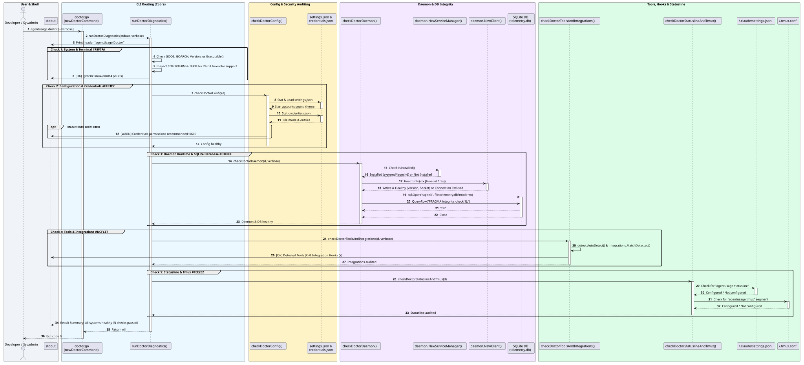

View PlantUML Source

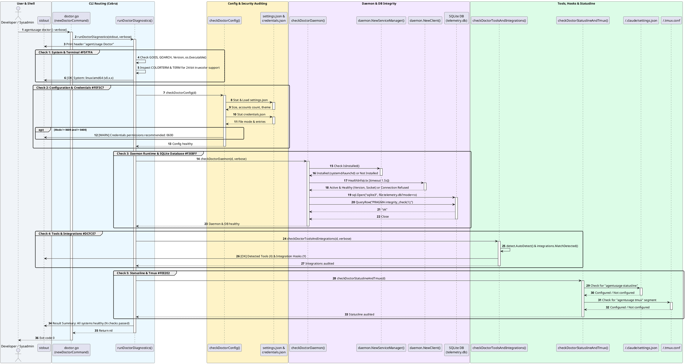
```plantuml
@startuml
autonumber
skinparam roundcorner 6
skinparam sequenceMessageAlign center
skinparam defaultFontName sans-serif

box "User & Shell" #F0F4F8
    actor User as "Developer / Sysadmin"
    participant Stdout as "stdout"
end box

box "CLI Routing (Cobra)" #EBF8FF
    participant Cmd as "doctor.go\n(newDoctorCommand)"
    participant Doc as "runDoctorDiagnostics()"
end box

box "Config & Security Auditing" #FEF3C7
    participant CfgCheck as "checkDoctorConfig()"
    participant CfgFile as "settings.json &\ncredentials.json"
end box

box "Daemon & DB Integrity" #F3E8FF
    participant DaemonCheck as "checkDoctorDaemon()"
    participant SvcMgr as "daemon.NewServiceManager()"
    participant Client as "daemon.NewClient()"
    participant DB as "SQLite DB\n(telemetry.db)"
end box

box "Tools, Hooks & Statusline" #DCFCE7
    participant ToolCheck as "checkDoctorToolsAndIntegrations()"
    participant TmuxCheck as "checkDoctorStatuslineAndTmux()"
    participant ClaudeConf as "~/.claude/settings.json"
    participant TmuxConf as "~/.tmux.conf"
end box

User -> Cmd ++ : agentusage doctor [--verbose]
Cmd -> Doc ++ : runDoctorDiagnostics(stdout, verbose)

Doc -> Stdout : Print header "agentUsage Doctor"

group Check 1: System & Terminal #F5F7FA
    Doc -> Doc : Check GOOS, GOARCH, Version, os.Executable()
    Doc -> Doc : Inspect COLORTERM & TERM for 24-bit truecolor support
    Doc -> Stdout : [OK] System: linux/amd64 (v0.x.x)
end

group Check 2: Configuration & Credentials #FEF3C7
    Doc -> CfgCheck ++ : checkDoctorConfig(d)
    CfgCheck -> CfgFile ++ : Stat & Load settings.json
    CfgFile --> CfgCheck -- : Size, accounts count, theme
    CfgCheck -> CfgFile ++ : Stat credentials.json
    CfgFile --> CfgCheck -- : File mode & entries
    opt Mode != 0600 and != 0400
        CfgCheck -> Stdout : [WARN] Credentials permissions recommended: 0600
    end
    CfgCheck --> Doc -- : Config healthy
end

group Check 3: Daemon Runtime & SQLite Database #F3E8FF
    Doc -> DaemonCheck ++ : checkDoctorDaemon(d, verbose)
    DaemonCheck -> SvcMgr ++ : Check IsInstalled()
    SvcMgr --> DaemonCheck -- : Installed (systemd/launchd) or Not Installed
    DaemonCheck -> Client ++ : HealthInfo(ctx [timeout 1.5s])
    Client --> DaemonCheck -- : Active & Healthy (Version, Socket) or Connection Refused
    DaemonCheck -> DB ++ : sql.Open("sqlite3", file:telemetry.db?mode=ro)
    DaemonCheck -> DB : QueryRow("PRAGMA integrity_check(1);")
    DB --> DaemonCheck : "ok"
    DB --> DaemonCheck -- : Close
    DaemonCheck --> Doc -- : Daemon & DB healthy
end

group Check 4: Tools & Integrations #DCFCE7
    Doc -> ToolCheck ++ : checkDoctorToolsAndIntegrations(d, verbose)
    ToolCheck -> ToolCheck : detect.AutoDetect() & integrations.MatchDetected()
    ToolCheck -> Stdout : [OK] Detected Tools (X) & Integration Hooks (Y)
    ToolCheck --> Doc -- : Integrations audited
end

group Check 5: Statusline & Tmux #FEE2E2
    Doc -> TmuxCheck ++ : checkDoctorStatuslineAndTmux(d)
    TmuxCheck -> ClaudeConf ++ : Check for "agentusage statusline"
    ClaudeConf --> TmuxCheck -- : Configured / Not configured
    TmuxCheck -> TmuxConf ++ : Check for "agentusage tmux" segment
    TmuxConf --> TmuxCheck -- : Configured / Not configured
    TmuxCheck --> Doc -- : Statusline audited
end

Doc -> Stdout : Result Summary: All systems healthy (N checks passed)
Doc --> Cmd -- : Return nil
Cmd --> User -- : Exit code 0
@enduml
```

---

## 8. `agentusage serve` (Web Dashboard Server)

The `serve` command hosts a browser-accessible web dashboard offering the same snapshot visualizations as the TUI. It supports three execution patterns: foreground server, background detached daemon with PID tracking, and TUI-to-Web parity validation.

### 8.1 Foreground Server Mode

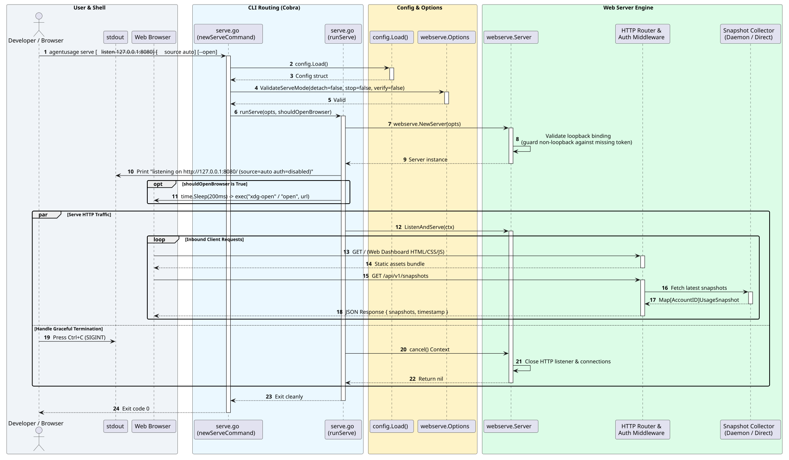

View PlantUML Source

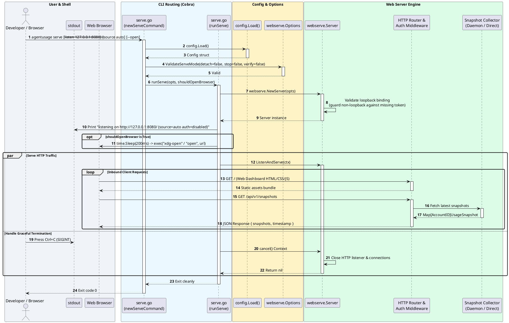
```plantuml
@startuml
autonumber
skinparam roundcorner 6
skinparam sequenceMessageAlign center
skinparam defaultFontName sans-serif

box "User & Shell" #F0F4F8
    actor User as "Developer / Browser"
    participant Stdout as "stdout"
    participant BrowserApp as "Web Browser"
end box

box "CLI Routing (Cobra)" #EBF8FF
    participant Cmd as "serve.go\n(newServeCommand)"
    participant Runner as "serve.go\n(runServe)"
end box

box "Config & Options" #FEF3C7
    participant Cfg as "config.Load()"
    participant Opts as "webserve.Options"
end box

box "Web Server Engine" #DCFCE7
    participant Server as "webserve.Server"
    participant Router as "HTTP Router &\nAuth Middleware"
    participant Collector as "Snapshot Collector\n(Daemon / Direct)"
end box

User -> Cmd ++ : agentusage serve [--listen 127.0.0.1:8080] [--source auto] [--open]
Cmd -> Cfg ++ : config.Load()
Cfg --> Cmd -- : Config struct
Cmd -> Opts ++ : ValidateServeMode(detach=false, stop=false, verify=false)
Opts --> Cmd -- : Valid

Cmd -> Runner ++ : runServe(opts, shouldOpenBrowser)
Runner -> Server ++ : webserve.NewServer(opts)
Server -> Server : Validate loopback binding\n(guard non-loopback against missing token)
Server --> Runner -- : Server instance

Runner -> Stdout : Print "listening on http://127.0.0.1:8080/ (source=auto auth=disabled)"

opt shouldOpenBrowser is True
    Runner -> BrowserApp : time.Sleep(200ms) -> exec("xdg-open" / "open", url)
end

par Serve HTTP Traffic
    Runner -> Server ++ : ListenAndServe(ctx)
    loop Inbound Client Requests
        BrowserApp -> Router ++ : GET / (Web Dashboard HTML/CSS/JS)
        Router --> BrowserApp -- : Static assets bundle
        BrowserApp -> Router ++ : GET /api/v1/snapshots
        Router -> Collector ++ : Fetch latest snapshots
        Collector --> Router -- : Map[AccountID]UsageSnapshot
        Router --> BrowserApp -- : JSON Response { snapshots, timestamp }
    end
else Handle Graceful Termination
    User -> Stdout : Press Ctrl+C (SIGINT)
    Runner -> Server : cancel() Context
    Server -> Server : Close HTTP listener & connections
    Server --> Runner -- : Return nil
end

Runner --> Cmd -- : Exit cleanly
Cmd --> User -- : Exit code 0
@enduml
```

### 8.2 Detached Daemon & Stop Mode (`--detach` / `--stop`)

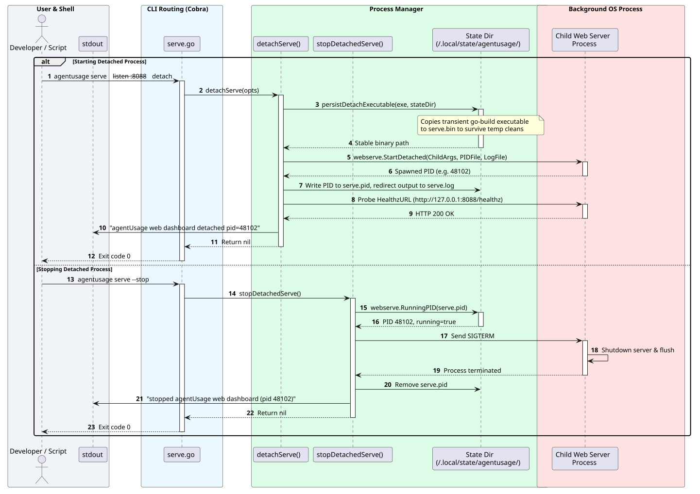

View PlantUML Source

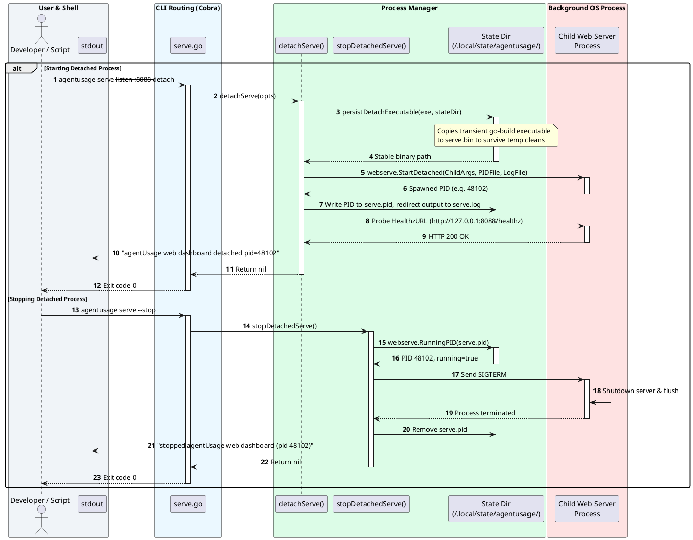
```plantuml
@startuml
autonumber
skinparam roundcorner 6
skinparam sequenceMessageAlign center
skinparam defaultFontName sans-serif

box "User & Shell" #F0F4F8
    actor User as "Developer / Script"
    participant Stdout as "stdout"
end box

box "CLI Routing (Cobra)" #EBF8FF
    participant Cmd as "serve.go"
end box

box "Process Manager" #DCFCE7
    participant Detach as "detachServe()"
    participant Stop as "stopDetachedServe()"
    participant FS as "State Dir\n(~/.local/state/agentusage/)"
end box

box "Background OS Process" #FEE2E2
    participant Child as "Child Web Server\nProcess"
end box

alt Starting Detached Process
    User -> Cmd ++ : agentusage serve --listen :8088 --detach
    Cmd -> Detach ++ : detachServe(opts)
    Detach -> FS ++ : persistDetachExecutable(exe, stateDir)
    note over FS : Copies transient go-build executable\nto serve.bin to survive temp cleans
    FS --> Detach -- : Stable binary path
    Detach -> Child ++ : webserve.StartDetached(ChildArgs, PIDFile, LogFile)
    Child --> Detach -- : Spawned PID (e.g. 48102)
    Detach -> FS : Write PID to serve.pid, redirect output to serve.log
    Detach -> Child ++ : Probe HealthzURL (http://127.0.0.1:8088/healthz)
    Child --> Detach -- : HTTP 200 OK
    Detach -> Stdout : "agentUsage web dashboard detached pid=48102"
    Detach --> Cmd -- : Return nil
    Cmd --> User -- : Exit code 0
else Stopping Detached Process
    User -> Cmd ++ : agentusage serve --stop
    Cmd -> Stop ++ : stopDetachedServe()
    Stop -> FS ++ : webserve.RunningPID(serve.pid)
    FS --> Stop -- : PID 48102, running=true
    Stop -> Child ++ : Send SIGTERM
    Child -> Child : Shutdown server & flush
    Child --> Stop -- : Process terminated
    Stop -> FS : Remove serve.pid
    Stop -> Stdout : "stopped agentUsage web dashboard (pid 48102)"
    Stop --> Cmd -- : Return nil
    Cmd --> User -- : Exit code 0
end
@enduml
```

### 8.3 TUI/Web Parity Verification Mode (`--verify`)

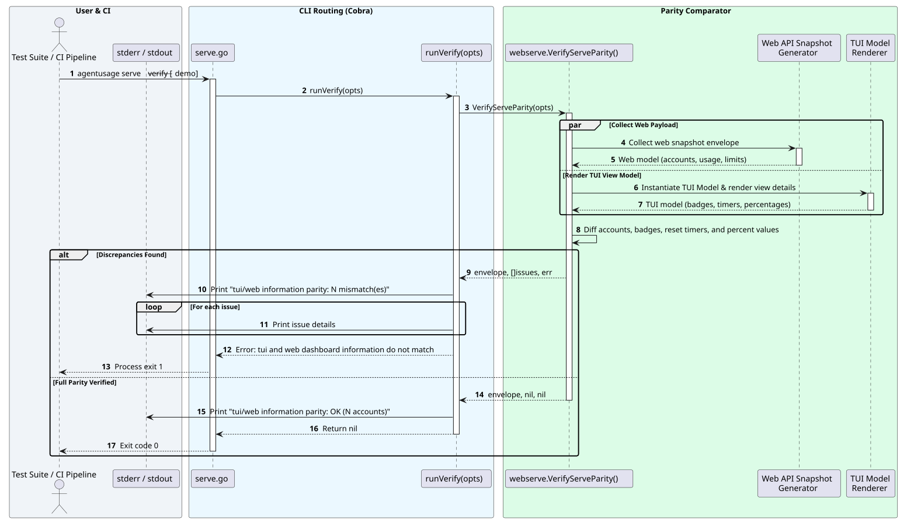

View PlantUML Source

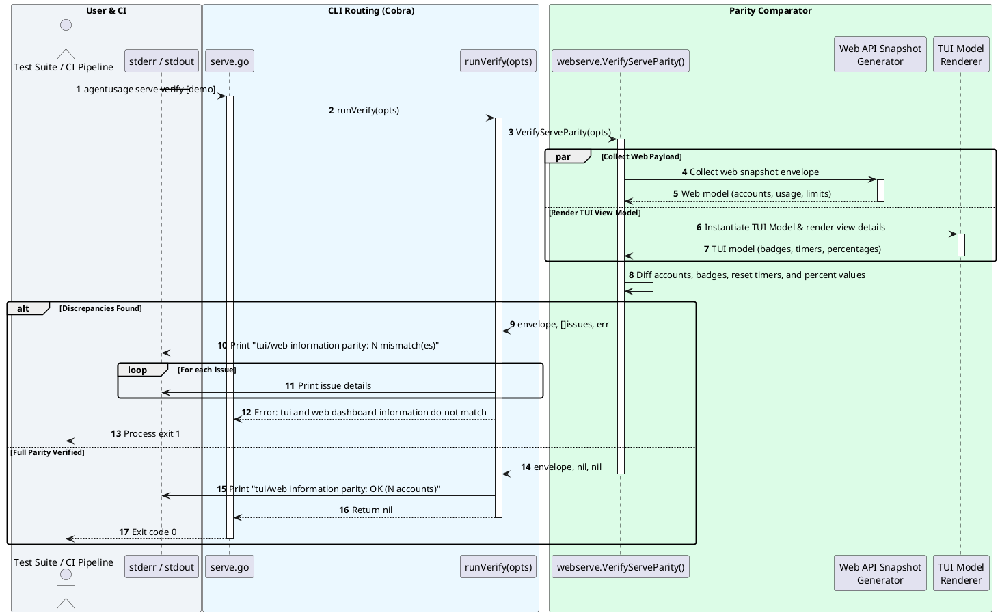
```plantuml
@startuml
autonumber
skinparam roundcorner 6
skinparam sequenceMessageAlign center
skinparam defaultFontName sans-serif

box "User & CI" #F0F4F8
    actor User as "Test Suite / CI Pipeline"
    participant Stderr as "stderr / stdout"
end box

box "CLI Routing (Cobra)" #EBF8FF
    participant Cmd as "serve.go"
    participant Verify as "runVerify(opts)"
end box

box "Parity Comparator" #DCFCE7
    participant Parity as "webserve.VerifyServeParity()"
    participant WebSnapshot as "Web API Snapshot\nGenerator"
    participant TUIModel as "TUI Model\nRenderer"
end box

User -> Cmd ++ : agentusage serve --verify [--demo]
Cmd -> Verify ++ : runVerify(opts)
Verify -> Parity ++ : VerifyServeParity(opts)

par Collect Web Payload
    Parity -> WebSnapshot ++ : Collect web snapshot envelope
    WebSnapshot --> Parity -- : Web model (accounts, usage, limits)
else Render TUI View Model
    Parity -> TUIModel ++ : Instantiate TUI Model & render view details
    TUIModel --> Parity -- : TUI model (badges, timers, percentages)
end

Parity -> Parity : Diff accounts, badges, reset timers, and percent values

alt Discrepancies Found
    Parity --> Verify : envelope, []issues, err
    Verify -> Stderr : Print "tui/web information parity: N mismatch(es)"
    loop For each issue
        Verify -> Stderr : Print issue details
    end
    Verify --> Cmd : Error: tui and web dashboard information do not match
    Cmd --> User : Process exit 1
else Full Parity Verified
    Parity --> Verify -- : envelope, nil, nil
    Verify -> Stderr : Print "tui/web information parity: OK (N accounts)"
    Verify --> Cmd -- : Return nil
    Cmd --> User -- : Exit code 0
end
@enduml
```

---

## 9. `agentusage daemon`

The `daemon` command group controls the background telemetry service responsible for high-frequency provider polling, hook ingestion from coding agents (Claude Code, OpenCode, Codex), SQLite storage, and deduplication.

### 9.1 `daemon run` (Foreground Poller & Ingestion Engine)

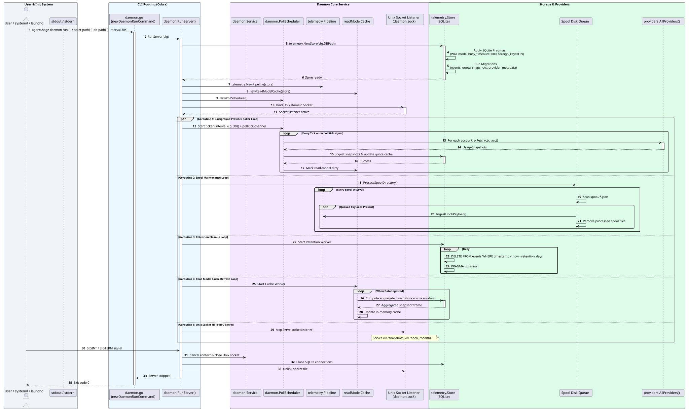

View PlantUML Source

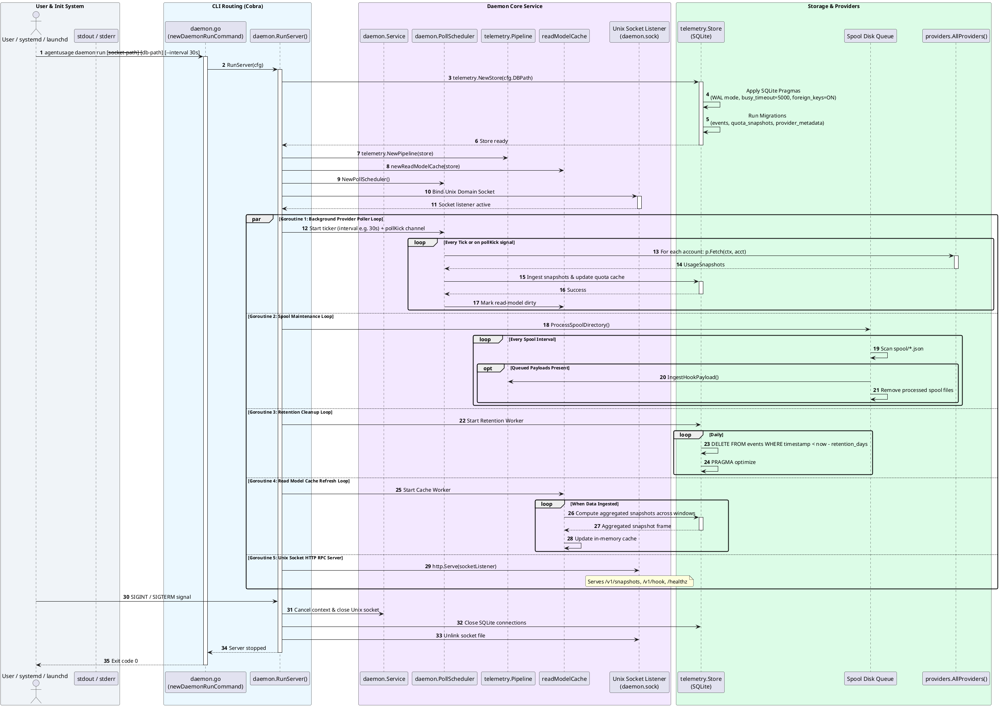
```plantuml
@startuml
autonumber
skinparam roundcorner 6
skinparam sequenceMessageAlign center
skinparam defaultFontName sans-serif

box "User & Init System" #F0F4F8
    actor User as "User / systemd / launchd"
    participant Stdout as "stdout / stderr"
end box

box "CLI Routing (Cobra)" #EBF8FF
    participant Cmd as "daemon.go\n(newDaemonRunCommand)"
    participant RunSvc as "daemon.RunServer()"
end box

box "Daemon Core Service" #F3E8FF
    participant Svc as "daemon.Service"
    participant Sched as "daemon.PollScheduler"
    participant Pipe as "telemetry.Pipeline"
    participant RM as "readModelCache"
    participant UnixSock as "Unix Socket Listener\n(daemon.sock)"
end box

box "Storage & Providers" #DCFCE7
    participant DB as "telemetry.Store\n(SQLite)"
    participant Spool as "Spool Disk Queue"
    participant Provs as "providers.AllProviders()"
end box

User -> Cmd ++ : agentusage daemon run [--socket-path] [--db-path] [--interval 30s]
Cmd -> RunSvc ++ : RunServer(cfg)

RunSvc -> DB ++ : telemetry.NewStore(cfg.DBPath)
DB -> DB : Apply SQLite Pragmas\n(WAL mode, busy_timeout=5000, foreign_keys=ON)
DB -> DB : Run Migrations\n(events, quota_snapshots, provider_metadata)
DB --> RunSvc -- : Store ready

RunSvc -> Pipe : telemetry.NewPipeline(store)
RunSvc -> RM : newReadModelCache(store)
RunSvc -> Sched : NewPollScheduler()
RunSvc -> UnixSock ++ : Bind Unix Domain Socket
UnixSock --> RunSvc -- : Socket listener active

par Goroutine 1: Background Provider Poller Loop
    RunSvc -> Sched : Start ticker (interval e.g. 30s) + pollKick channel
    loop Every Tick or on pollKick signal
        Sched -> Provs ++ : For each account: p.Fetch(ctx, acct)
        Provs --> Sched -- : UsageSnapshots
        Sched -> DB ++ : Ingest snapshots & update quota cache
        DB --> Sched -- : Success
        Sched -> RM : Mark read-model dirty
    end
else Goroutine 2: Spool Maintenance Loop
    RunSvc -> Spool : ProcessSpoolDirectory()
    loop Every Spool Interval
        Spool -> Spool : Scan spool/*.json
        opt Queued Payloads Present
            Spool -> Pipe : IngestHookPayload()
            Spool -> Spool : Remove processed spool files
        end
    end
else Goroutine 3: Retention Cleanup Loop
    RunSvc -> DB : Start Retention Worker
    loop Daily
        DB -> DB : DELETE FROM events WHERE timestamp < now - retention_days
        DB -> DB : PRAGMA optimize
    end
else Goroutine 4: Read Model Cache Refresh Loop
    RunSvc -> RM : Start Cache Worker
    loop When Data Ingested
        RM -> DB ++ : Compute aggregated snapshots across windows
        DB --> RM -- : Aggregated snapshot frame
        RM -> RM : Update in-memory cache
    end
else Goroutine 5: Unix Socket HTTP RPC Server
    RunSvc -> UnixSock : http.Serve(socketListener)
    note over UnixSock : Serves /v1/snapshots, /v1/hook, /healthz
end

User -> RunSvc : SIGINT / SIGTERM signal
RunSvc -> Svc : Cancel context & close Unix socket
RunSvc -> DB : Close SQLite connections
RunSvc -> UnixSock : Unlink socket file
RunSvc --> Cmd -- : Server stopped
Cmd --> User -- : Exit code 0
@enduml
```

### 9.2 `daemon status` (Runtime & Socket Health Inspection)

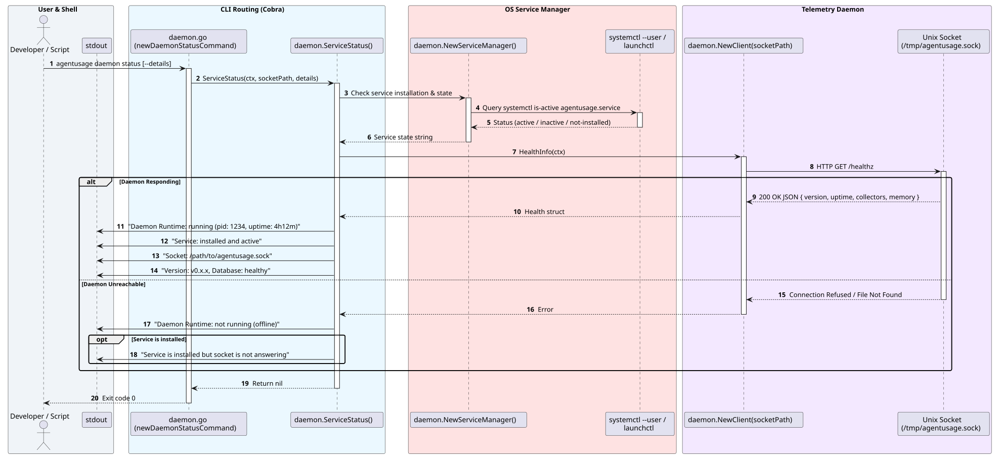

View PlantUML Source

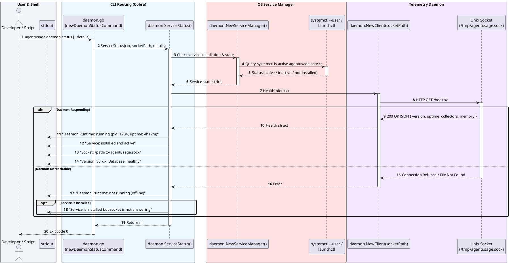
```plantuml
@startuml
autonumber
skinparam roundcorner 6
skinparam sequenceMessageAlign center
skinparam defaultFontName sans-serif

box "User & Shell" #F0F4F8
    actor User as "Developer / Script"
    participant Stdout as "stdout"
end box

box "CLI Routing (Cobra)" #EBF8FF
    participant Cmd as "daemon.go\n(newDaemonStatusCommand)"
    participant Status as "daemon.ServiceStatus()"
end box

box "OS Service Manager" #FEE2E2
    participant Mgr as "daemon.NewServiceManager()"
    participant OS as "systemctl --user /\nlaunchctl"
end box

box "Telemetry Daemon" #F3E8FF
    participant Client as "daemon.NewClient(socketPath)"
    participant Sock as "Unix Socket\n(/tmp/agentusage.sock)"
end box

User -> Cmd ++ : agentusage daemon status [--details]
Cmd -> Status ++ : ServiceStatus(ctx, socketPath, details)

Status -> Mgr ++ : Check service installation & state
Mgr -> OS ++ : Query systemctl is-active agentusage.service
OS --> Mgr -- : Status (active / inactive / not-installed)
Mgr --> Status -- : Service state string

Status -> Client ++ : HealthInfo(ctx)
Client -> Sock ++ : HTTP GET /healthz
alt Daemon Responding
    Sock --> Client : 200 OK JSON { version, uptime, collectors, memory }
    Client --> Status : Health struct
    Status -> Stdout : "Daemon Runtime: running (pid: 1234, uptime: 4h12m)"
    Status -> Stdout : "Service: installed and active"
    Status -> Stdout : "Socket: /path/to/agentusage.sock"
    Status -> Stdout : "Version: v0.x.x, Database: healthy"
else Daemon Unreachable
    Sock --> Client -- : Connection Refused / File Not Found
    Client --> Status -- : Error
    Status -> Stdout : "Daemon Runtime: not running (offline)"
    opt Service is installed
        Status -> Stdout : "Service is installed but socket is not answering"
    end
end

Status --> Cmd -- : Return nil
Cmd --> User -- : Exit code 0
@enduml
```

### 9.3 `daemon install` & `uninstall` (Service Lifecycle Management)

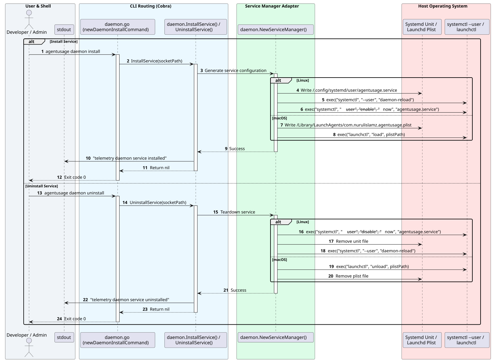

View PlantUML Source

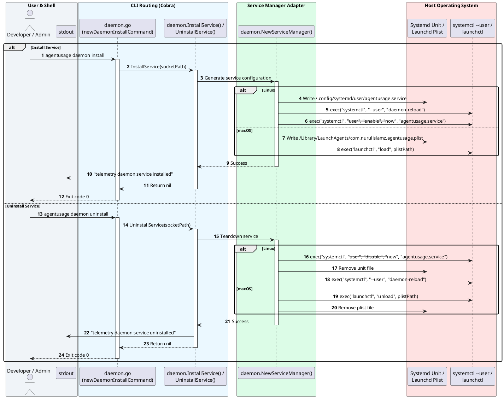
```plantuml
@startuml
autonumber
skinparam roundcorner 6
skinparam sequenceMessageAlign center
skinparam defaultFontName sans-serif

box "User & Shell" #F0F4F8
    actor User as "Developer / Admin"
    participant Stdout as "stdout"
end box

box "CLI Routing (Cobra)" #EBF8FF
    participant Cmd as "daemon.go\n(newDaemonInstallCommand)"
    participant Svc as "daemon.InstallService() /\nUninstallService()"
end box

box "Service Manager Adapter" #DCFCE7
    participant Mgr as "daemon.NewServiceManager()"
end box

box "Host Operating System" #FEE2E2
    participant UnitFile as "Systemd Unit /\nLaunchd Plist"
    participant InitSystem as "systemctl --user /\nlaunchctl"
end box

alt Install Service
    User -> Cmd ++ : agentusage daemon install
    Cmd -> Svc ++ : InstallService(socketPath)
    Svc -> Mgr ++ : Generate service configuration
    alt Linux
        Mgr -> UnitFile : Write ~/.config/systemd/user/agentusage.service
        Mgr -> InitSystem : exec("systemctl", "--user", "daemon-reload")
        Mgr -> InitSystem : exec("systemctl", "--user", "enable", "--now", "agentusage.service")
    else macOS
        Mgr -> UnitFile : Write ~/Library/LaunchAgents/com.nurulislamz.agentusage.plist
        Mgr -> InitSystem : exec("launchctl", "load", plistPath)
    end
    Mgr --> Svc -- : Success
    Svc -> Stdout : "telemetry daemon service installed"
    Svc --> Cmd -- : Return nil
    Cmd --> User -- : Exit code 0
else Uninstall Service
    User -> Cmd ++ : agentusage daemon uninstall
    Cmd -> Svc ++ : UninstallService(socketPath)
    Svc -> Mgr ++ : Teardown service
    alt Linux
        Mgr -> InitSystem : exec("systemctl", "--user", "disable", "--now", "agentusage.service")
        Mgr -> UnitFile : Remove unit file
        Mgr -> InitSystem : exec("systemctl", "--user", "daemon-reload")
    else macOS
        Mgr -> InitSystem : exec("launchctl", "unload", plistPath)
        Mgr -> UnitFile : Remove plist file
    end
    Mgr --> Svc -- : Success
    Svc -> Stdout : "telemetry daemon service uninstalled"
    Svc --> Cmd -- : Return nil
    Cmd --> User -- : Exit code 0
end
@enduml
```

### 9.4 `daemon hook <source> [payload]` (Telemetry Ingest & Local Fallback)

External AI agent tools (such as Claude Code hooks, OpenCode telemetry, or Codex notify scripts) emit event payloads via stdin or positional arguments. The command tries the fast daemon socket RPC first, falling back cleanly to direct local SQLite writes or spooling when the daemon is offline.

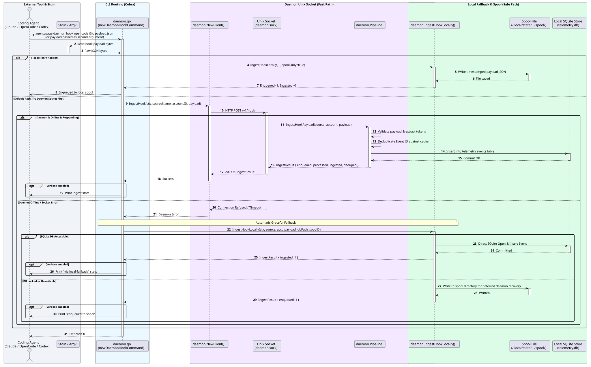

View PlantUML Source

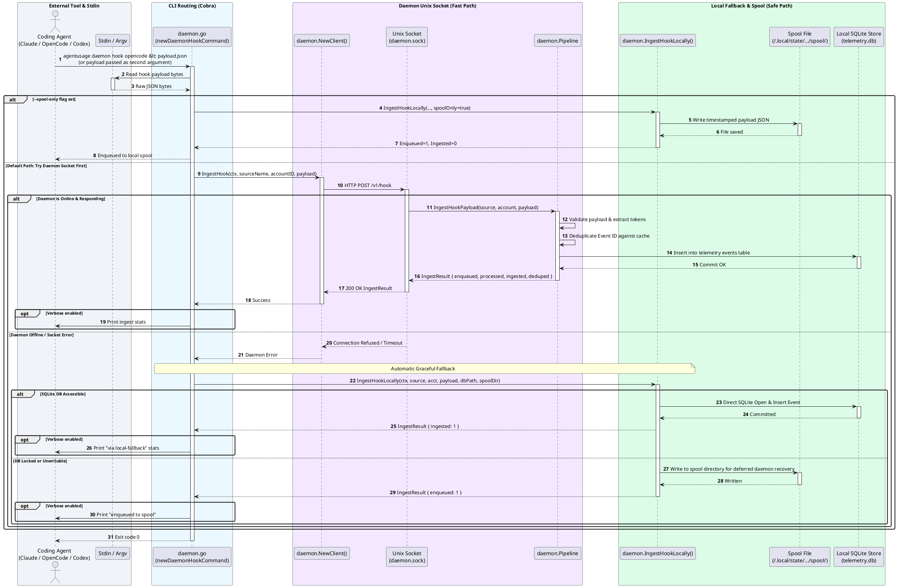
```plantuml
@startuml
autonumber
skinparam roundcorner 6
skinparam sequenceMessageAlign center
skinparam defaultFontName sans-serif

box "External Tool & Stdin" #F0F4F8
    actor Agent as "Coding Agent\n(Claude / OpenCode / Codex)"
    participant Stdin as "Stdin / Argv"
end box

box "CLI Routing (Cobra)" #EBF8FF
    participant Cmd as "daemon.go\n(newDaemonHookCommand)"
end box

box "Daemon Unix Socket (Fast Path)" #F3E8FF
    participant Client as "daemon.NewClient()"
    participant DaemonSock as "Unix Socket\n(daemon.sock)"
    participant Pipe as "daemon.Pipeline"
end box

box "Local Fallback & Spool (Safe Path)" #DCFCE7
    participant Local as "daemon.IngestHookLocally()"
    participant Spool as "Spool File\n(~/.local/state/.../spool/)"
    participant DB as "Local SQLite Store\n(telemetry.db)"
end box

Agent -> Cmd ++ : agentusage daemon hook opencode &lt; payload.json\n(or payload passed as second argument)
Cmd -> Stdin ++ : Read hook payload bytes
Stdin --> Cmd -- : Raw JSON bytes

alt --spool-only flag set
    Cmd -> Local ++ : IngestHookLocally(..., spoolOnly=true)
    Local -> Spool ++ : Write timestamped payload JSON
    Spool --> Local -- : File saved
    Local --> Cmd -- : Enqueued=1, Ingested=0
    Cmd --> Agent : Enqueued to local spool
else Default Path: Try Daemon Socket First
    Cmd -> Client ++ : IngestHook(ctx, sourceName, accountID, payload)
    Client -> DaemonSock ++ : HTTP POST /v1/hook
    alt Daemon is Online & Responding
        DaemonSock -> Pipe ++ : IngestHookPayload(source, account, payload)
        Pipe -> Pipe : Validate payload & extract tokens
        Pipe -> Pipe : Deduplicate Event ID against cache
        Pipe -> DB ++ : Insert into telemetry events table
        DB --> Pipe -- : Commit OK
        Pipe --> DaemonSock -- : IngestResult { enqueued, processed, ingested, deduped }
        DaemonSock --> Client -- : 200 OK IngestResult
        Client --> Cmd -- : Success
        opt Verbose enabled
            Cmd -> Agent : Print ingest stats
        end
    else Daemon Offline / Socket Error
        DaemonSock --> Client : Connection Refused / Timeout
        Client --> Cmd : Daemon Error
        
        note over Cmd, Local : Automatic Graceful Fallback
        Cmd -> Local ++ : IngestHookLocally(ctx, source, acct, payload, dbPath, spoolDir)
        alt SQLite DB Accessible
            Local -> DB ++ : Direct SQLite Open & Insert Event
            DB --> Local -- : Committed
            Local --> Cmd : IngestResult { ingested: 1 }
            opt Verbose enabled
                Cmd -> Agent : Print "via local-fallback" stats
            end
        else DB Locked or Unwritable
            Local -> Spool ++ : Write to spool directory for deferred daemon recovery
            Spool --> Local -- : Written
            Local --> Cmd -- : IngestResult { enqueued: 1 }
            opt Verbose enabled
                Cmd -> Agent : Print "enqueued to spool"
            end
        end
    end
end
Cmd --> Agent -- : Exit code 0
@enduml
```

---

## 10. Configuration & Credential Architecture (`config` Lifecycle)

While `agentusage` has no standalone `config` top-level CLI command, the configuration and credential subsystem is a core pipeline shared across every command. It enforces a strict security posture: general preferences are stored in world-readable `settings.json`, while secrets and browser cookies live in `credentials.json` with strict `0600` permissions.

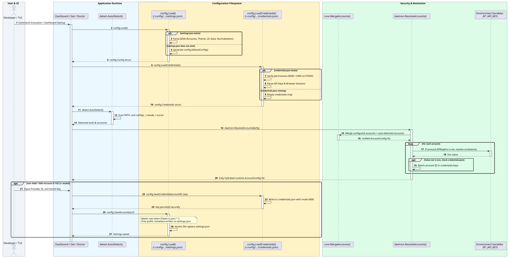

View PlantUML Source

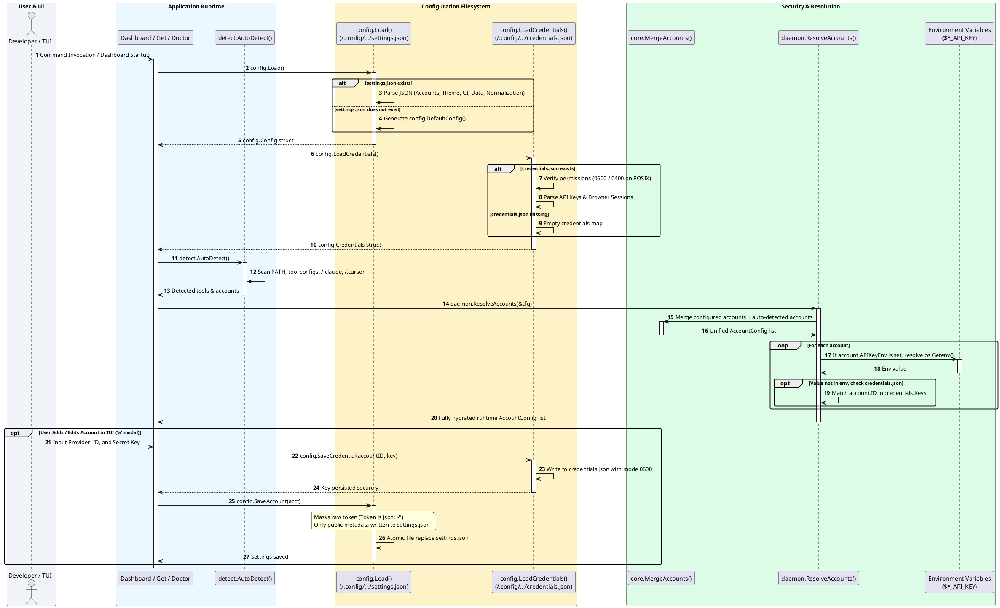
```plantuml
@startuml
autonumber
skinparam roundcorner 6
skinparam sequenceMessageAlign center
skinparam defaultFontName sans-serif

box "User & UI" #F0F4F8
    actor User as "Developer / TUI"
end box

box "Application Runtime" #EBF8FF
    participant App as "Dashboard / Get / Doctor"
    participant Detect as "detect.AutoDetect()"
end box

box "Configuration Filesystem" #FEF3C7
    participant Cfg as "config.Load()\n(~/.config/.../settings.json)"
    participant Cred as "config.LoadCredentials()\n(~/.config/.../credentials.json)"
end box

box "Security & Resolution" #DCFCE7
    participant Merge as "core.MergeAccounts()"
    participant Resolver as "daemon.ResolveAccounts()"
    participant Env as "Environment Variables\n($*_API_KEY)"
end box

User -> App ++ : Command Invocation / Dashboard Startup
App -> Cfg ++ : config.Load()
alt settings.json exists
    Cfg -> Cfg : Parse JSON (Accounts, Theme, UI, Data, Normalization)
else settings.json does not exist
    Cfg -> Cfg : Generate config.DefaultConfig()
end
Cfg --> App -- : config.Config struct

App -> Cred ++ : config.LoadCredentials()
alt credentials.json exists
    Cred -> Cred : Verify permissions (0600 / 0400 on POSIX)
    Cred -> Cred : Parse API Keys & Browser Sessions
else credentials.json missing
    Cred -> Cred : Empty credentials map
end
Cred --> App -- : config.Credentials struct

App -> Detect ++ : detect.AutoDetect()
Detect -> Detect : Scan PATH, tool configs, ~/.claude, ~/.cursor
Detect --> App -- : Detected tools & accounts

App -> Resolver ++ : daemon.ResolveAccounts(&cfg)
Resolver -> Merge ++ : Merge configured accounts + auto-detected accounts
Merge --> Resolver -- : Unified AccountConfig list
loop For each account
    Resolver -> Env ++ : If account.APIKeyEnv is set, resolve os.Getenv()
    Env --> Resolver -- : Env value
    opt Value not in env, check credentials.json
        Resolver -> Resolver : Match account.ID in credentials.Keys
    end
end
Resolver --> App -- : Fully hydrated runtime AccountConfig list

opt User Adds / Edits Account in TUI ('a' modal)
    User -> App : Input Provider, ID, and Secret Key
    App -> Cred ++ : config.SaveCredential(accountID, key)
    Cred -> Cred : Write to credentials.json with mode 0600
    Cred --> App -- : Key persisted securely
    App -> Cfg ++ : config.SaveAccount(acct)
    note over Cfg : Masks raw token (Token is json:"-")\nOnly public metadata written to settings.json
    Cfg -> Cfg : Atomic file replace settings.json
    Cfg --> App -- : Settings saved
end
@enduml
```

---

## 11. Demo Simulation Flow (`agentusage demo`)

The standalone demo runner (`cmd/demo/main.go`) executes a simulated, zero-dependency environment with realistic synthetic snapshots across all 37 providers for visual testing and documentation previews.

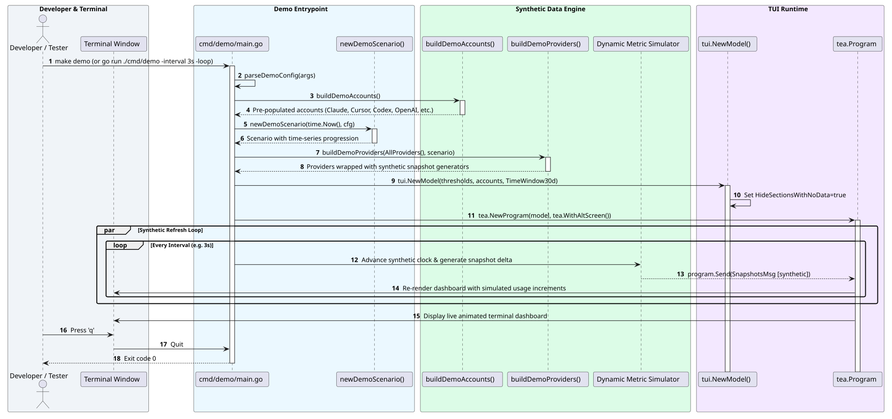

View PlantUML Source

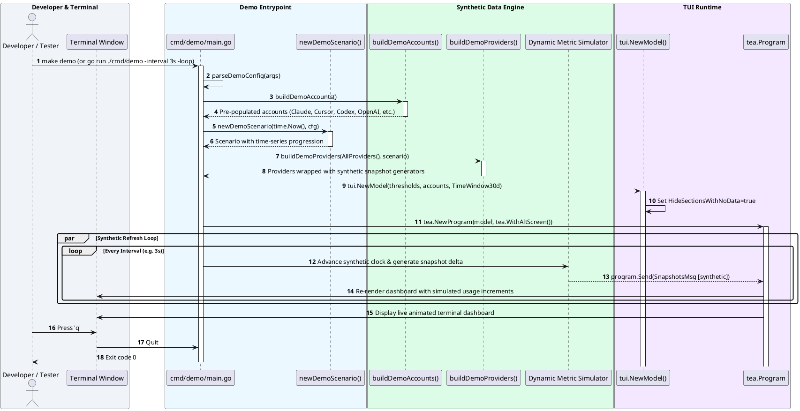
```plantuml
@startuml
autonumber
skinparam roundcorner 6
skinparam sequenceMessageAlign center
skinparam defaultFontName sans-serif

box "Developer & Terminal" #F0F4F8
    actor User as "Developer / Tester"
    participant TTY as "Terminal Window"
end box

box "Demo Entrypoint" #EBF8FF
    participant Main as "cmd/demo/main.go"
    participant Scenario as "newDemoScenario()"
end box

box "Synthetic Data Engine" #DCFCE7
    participant Accts as "buildDemoAccounts()"
    participant Provs as "buildDemoProviders()"
    participant Ticks as "Dynamic Metric Simulator"
end box

box "TUI Runtime" #F3E8FF
    participant Model as "tui.NewModel()"
    participant Tea as "tea.Program"
end box

User -> Main ++ : make demo (or go run ./cmd/demo -interval 3s -loop)
Main -> Main : parseDemoConfig(args)
Main -> Accts ++ : buildDemoAccounts()
Accts --> Main -- : Pre-populated accounts (Claude, Cursor, Codex, OpenAI, etc.)

Main -> Scenario ++ : newDemoScenario(time.Now(), cfg)
Scenario --> Main -- : Scenario with time-series progression

Main -> Provs ++ : buildDemoProviders(AllProviders(), scenario)
Provs --> Main -- : Providers wrapped with synthetic snapshot generators

Main -> Model ++ : tui.NewModel(thresholds, accounts, TimeWindow30d)
Model -> Model : Set HideSectionsWithNoData=true
Main -> Tea ++ : tea.NewProgram(model, tea.WithAltScreen())

par Synthetic Refresh Loop
    loop Every Interval (e.g. 3s)
        Main -> Ticks : Advance synthetic clock & generate snapshot delta
        Ticks --> Tea : program.Send(SnapshotsMsg [synthetic])
        Tea -> TTY : Re-render dashboard with simulated usage increments
    end
end

Tea -> TTY : Display live animated terminal dashboard
User -> TTY : Press 'q'
TTY -> Main : Quit
Main --> User -- : Exit code 0
@enduml
```

---

## 12. Summary Table of Commands & Architecture Interfaces

| Command | File Path | Primary Responsibilities | Concurrency / Goroutines | Fallback Mechanism |
|---|---|---|---|---|
| **`agentusage`** | `cmd/agentusage/dashboard.go` | Bubble Tea interactive terminal dashboard, multi-account view, window toggles | Broadcaster ticker, async enrichment (Cursor, AGY, OpenCode), app update checker, exporter | Falls back from daemon socket to direct provider polling |
| **`get <id>`** | `cmd/agentusage/get.go` | Fetch usage & limits for a box or account (5h limit default); outputs JSON, plain %, or table | Synchronous context timeout (default 10s) | Fuzzy account matching (ID -> provider -> prefix) |
| **`list`** | `cmd/agentusage/list.go` | List available accounts, providers, auth modes, and container statuses | Synchronous | Auto-detects terminal vs pipe for table vs JSON output |
| **`detect`** | `cmd/agentusage/detect.go` | Discovers local AI tools in PATH, local dirs, env vars, and credentials | Parallel filesystem & PATH discovery | Read-only; masks all keys with zero disk mutation |
| **`doctor`** | `cmd/agentusage/doctor.go` | System health, permissions, daemon socket, SQLite integrity, integrations | Synchronous with bounded sub-timeouts (1.5s daemon probe) | Graceful degradation if daemon service is not installed |
| **`serve`** | `cmd/agentusage/serve.go` | Web dashboard HTTP server, background detachment, TUI/web parity testing | HTTP server goroutine, browser launcher, signal trap | Fallback from daemon to direct poll; auto-copies binary on detach |
| **`daemon run`** | `cmd/agentusage/daemon.go` | Telemetry background daemon, SQLite store, socket RPC, provider poller | Poller loop, spool cleaner, daily retention, read model cache, socket server | Poll scheduler coalesces burst kicks into single fetch |
| **`daemon status`** | `cmd/agentusage/daemon.go` | Inspects system service state and probes daemon health via socket | Bounded socket RPC | Probes both OS service manager and raw Unix socket |
| **`daemon install` / `uninstall`** | `cmd/agentusage/daemon.go` | Installs/uninstalls systemd user unit or launchd LaunchAgent | Synchronous OS command exec | Platform detection (Linux systemd vs macOS launchd) |
| **`daemon hook`** | `cmd/agentusage/daemon.go` | Ingests agent telemetry events from stdin or argv | Asynchronous HTTP over Unix domain socket | Falls back to local direct SQLite write, then to local spool queue |
| **`config` (Lifecycle)** | `internal/config/` | Secure credentials (0600) vs public settings separation, account merging | Protected by `saveMu` and `credMu` package mutexes | Fallback to auto-detected default config if file unreadable |
| **`demo`** | `cmd/demo/main.go` | Realistic synthetic telemetry scenario replay for UI validation | Simulated ticker loop | 100% synthetic, zero network/disk dependencies |
