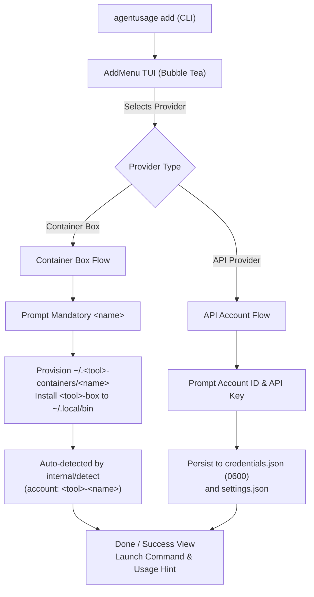

# Design Document: `agentusage add` Box & Provider Account TUI

Date: 2026-09-24
Status: Approved

## Overview

`agentusage add` (aliased as `agu add`) provides an interactive terminal user interface (TUI) to easily create multi-account container boxes for CLI agents (such as `codex-box`, `agy-box`, `agent-box`, and `opencode-box`) and configure API key accounts for cloud model providers.

## Background & Motivation

`agentusage` supports multiple containerized CLI environments using Bubblewrap (`bwrap`) to isolate configs and auth tokens into separate directory trees (e.g. `~/.agy-containers/`, `~/.agent-containers/`, and `~/.opencode-containers/`). Previously:
1. Creating a box required executing shell scripts (`agy-box add <name>`, `agent-box add <name>`, `opencode-box add <name>`) or running `make box <kind> NAME=<name>`.
2. There was no top-level `agentusage add` command.
3. OpenAI's Codex CLI had no container box runner (`codex-box`) or multi-container auto-detection in `agentusage`.
4. Adding new accounts or boxes required manual CLI commands or navigating the full dashboard settings modal.

## Requirements

1. **CLI Command**:
   - `agentusage add` and alias `agu add`.
   - Starts a lightweight, dedicated Bubble Tea TUI.
2. **Provider & Box Selection Menu**:
   - Display all available providers categorized into:
     - **Container Boxes**: Codex, Antigravity, Cursor, OpenCode.
     - **API Providers**: OpenAI, Anthropic, OpenRouter, Groq, Mistral, Perplexity, DeepSeek, etc.
   - Filterable search bar (`/` or direct typing) to quickly find providers.
3. **Mandatory Name Convention for Container Boxes**:
   - Users must explicitly provide a `<name>` for any new box (e.g., `dev`, `personal`, `client-a`).
   - Empty input is disallowed.
   - Illegal characters (spaces, slashes, leading hyphens) are rejected with clear inline validation errors.
4. **`codex-box` Runner & Scaffolding**:
   - Create `scripts/boxes/codex-box` mirroring the conventions of `agy-box` and `agent-box`.
   - Isolates `~/.codex` into `~/.codex-containers/<name>/.codex`.
   - Supports `codex-box add <name>`, `codex-box <name> [args]`, `codex-box list`, `codex-box rm <name>`.
   - Integrates with `scripts/box.sh` and `make box`.
5. **Auto-Detection for Multi-Container Codex**:
   - Update `internal/detect/codex.go` to scan `~/.codex-containers/` for profile subdirectories and register accounts as `codex-<name>` with hint `box_name: <name>`.
6. **Unified Box Management Service**:
   - Provide helper in `internal/boxes/` to programmatically provision box directories and install runner scripts into `~/.local/bin/`.
7. **Immediate Dashboard & Query Availability**:
   - Newly created boxes and accounts are immediately queryable via `agentusage list` and `agentusage get <id>` / `agentusage get <box_name>`.

## Technical Architecture

### Component Details

### 1. `cmd/agentusage/add.go`
- Registers `addCmd` with aliases `["create", "new"]`.
- Added to the `everyday` group in `cmd/agentusage/main.go`.
- Launches `tui.RunAddMenu()`.

### 2. `scripts/boxes/codex-box`
- Container runner script for Codex CLI:
  - Base directory: `~/.codex-containers`
  - Subcommands: `add`, `list` / `ls`, `rm` / `delete`, help, or default launch `<box-name> [args...]`.
  - Bubblewrap command:
    - Mounts `--bind "$PROFILE_DIR/.codex" "$HOME/.codex"`.
    - Mounts runtime socket directories and system paths.
    - Executes `codex "$@"`.

### 3. `internal/detect/codex.go`
- Extend `DetectCodex()` to scan `~/.codex-containers/`:
  - For each subfolder containing `.codex` or valid directory entry:
    - Registers account: `ID: fmt.Sprintf("codex-%s", name)`
    - Hints: `box_name: name`, `config_dir: <box_path>/.codex`, `auth_file: <box_path>/.codex/auth.json`.
    - If `auth.json` contains token or API key, extracts credentials.

### 4. `internal/boxes/` Manager
- Package functions:
  - `CreateContainerBox(provider string, name string) (BoxInfo, error)`
  - `InstallBoxRunner(provider string) (string, error)`
  - Supports `codex`, `antigravity`, `cursor`, `opencode`.

### 5. `internal/tui/add_menu.go`
- Bubble Tea program:
  - Model states:
    - `stateSelectProvider`: List of providers with badges `[Container Box]` vs `[API Key]`. Fuzzy filter bar.
    - `stateInputBoxName`: Input box with real-time validation:
      - Empty input disabled.
      - Disallowed characters flagged.
      - Existing box collision detected.
    - `stateInputAPIKey`: Inputs for Account ID and API Key / Env Var.
    - `stateSuccess`: Shows created account ID, storage path, launch command (`codex-box <name>`), and usage inspection (`agentusage get <name>`).

## Error Handling & Edge Cases

- **Bubblewrap not installed**: Warns the user when creating a container box that `bwrap` is required to launch the container.
- **Path collisions**: Checks if `~/.<provider>-containers/<name>` already exists before writing.
- **Terminal resizing**: TUI handles terminal resize events smoothly with standard width/height clamping.
- **Non-interactive environments**: Exits with error instructing usage if stdin is not a terminal, or accepts optional positional arguments.

## Verification & Testing

1. **Unit Tests**:
   - `internal/detect/codex_test.go`: Verify multi-container detection of `.codex-containers`.
   - `internal/boxes/codex_test.go`: Test box creation, duplicate prevention, and inspection.
   - `cmd/agentusage/add_test.go`: Test CLI flags, help text, and command registration.
2. **Script Fixture Tests**:
   - `scripts/box_test.sh`: Add test cases for `codex-box syntax`, `codex-box add`, `codex-box list`, `codex-box rm`.
3. **Manual / Interactive Verification**:
   - Run `go run ./cmd/agentusage add` in terminal.
   - Create a box (e.g. `codex-box testbox`).
   - Verify `agentusage list` shows `codex-testbox`.
   - Verify `agentusage get testbox` resolves.
