# agentUsage User Flow Diagrams (Functional Guide)

> [!NOTE]
> Looking for deep architectural details, internal Go packages, socket handlers, mutex locks, and SQLite schema mechanics? See [Command Flow Architecture & Swimlane Diagrams](COMMAND_FLOW_DIAGRAMS.md). This document focuses exclusively on the **functional user experience**—what each feature does, how it behaves, what keystrokes or flags you use, and what outputs you see.

This guide provides clean, intuitive sequence diagrams for every major feature of `agentUsage`. Each section answers two simple questions:
1. **What does this feature do?**
2. **How does it function step-by-step?**

Pre-rendered SVG diagrams are embedded for direct viewing in GitHub, VS Code, and any markdown reader. The underlying diagram source is available in collapsible sections.

---

## Quick Reference: Feature Flow Index

| Category | Command / Feature | What It Does |
|---|---|---|
| **Terminal Dashboard** | `agentusage` | Launches interactive full-screen terminal dashboard (Bubble Tea) |
| | `1`–`5` (View Layouts) | Switches between Tiles, Bento, Matrix, Cockpit, and Gauge Boards |
| | `w` / `1`–`7` (Time Windows) | Cycles quota horizons (5h rolling limit, 24h, 7d, 30d, billing, lifetime) |
| | `a` (Add Account) | In-app modal to add AI providers and store credentials securely (0600) |
| | `s` (Settings Modal) | Customizes visual themes, refresh rates, alert thresholds, and cost visibility |
| **CLI & Auditing** | `agentusage get <id>` | Fast quota and rate limit query (plain %, table, or JSON) |
| | `agentusage list` | Lists all configured and detected accounts with health statuses |
| | `agentusage detect` | Audits workstation for AI tools, configs, and masked credentials |
| | `agentusage doctor` | Comprehensive 5-point environment, security, daemon, and hook audit |
| **Web Dashboard** | `agentusage serve` | Launches browser-based dashboard on localhost with real-time cards |
| | `agentusage serve --detach` / `--stop` | Manages persistent background web daemon with PID lifecycle |
| | `agentusage serve --verify` | Automated TUI-to-Web visual and numerical parity audit |
| **Telemetry Daemon** | `agentusage daemon run` / `status` | Starts polling engine or checks daemon socket and database health |
| | `agentusage daemon install` / `uninstall` | Registers telemetry daemon as OS background service (systemd/launchd) |
| | `agentusage daemon hook <source>` | Ingests real-time events from Claude Code, OpenCode, and Codex hooks |
| **Simulation** | `agentusage demo` | Launches interactive simulation dashboard with synthetic workloads |

---

## 1. Interactive Terminal Dashboard (TUI Experience)

The primary interface of `agentUsage` is a full-screen, high-performance terminal dashboard built with Bubble Tea. It delivers real-time visibility into AI coding agent usage, rate limits, spending, and quota reset schedules across 37 supported providers.

---

### 1.1 `agentusage` (Launch Interactive Terminal Dashboard)

#### What does it do?
Launches the full-screen Bubble Tea terminal interface in your terminal's alternate screen (`AltScreen`). It displays active AI coding providers, color-coded rate limit gauges, current token consumption, estimated spend in USD, 5-hour rolling limits, and countdown timers until rate limits reset.

#### Functional Sequence Diagram

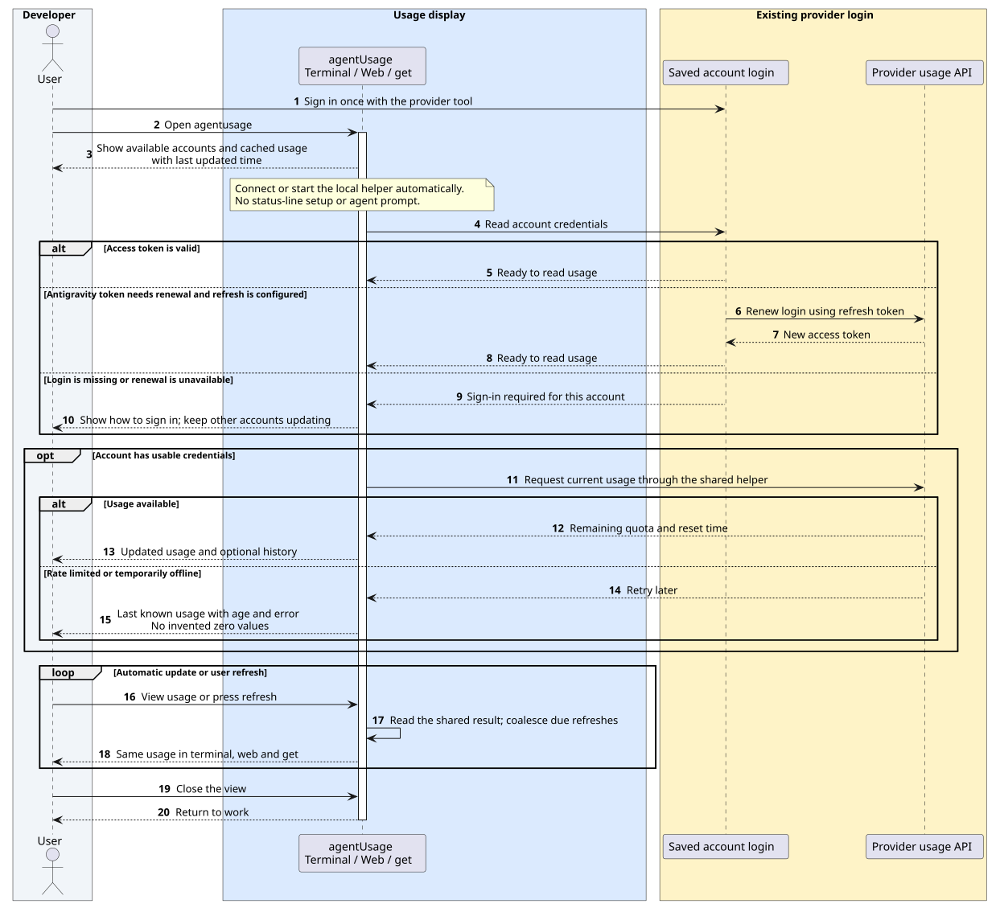

View Diagram Source

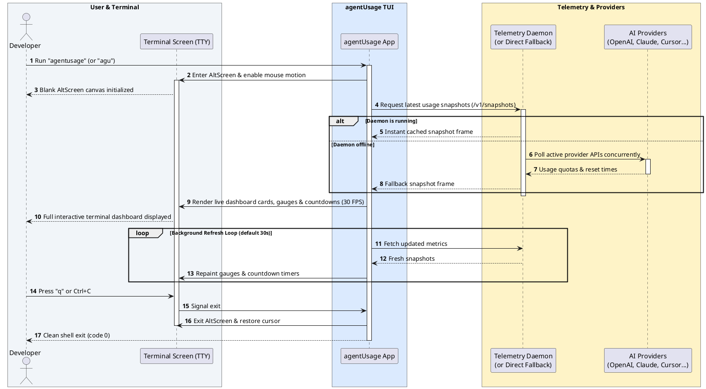
```plantuml
@startuml
autonumber
skinparam BoxPadding 15
skinparam ParticipantPadding 15

box "User & Terminal" #F1F5F9
    actor User as "Developer"
    participant TTY as "Terminal Screen (TTY)"
end box

box "agentUsage TUI" #DBEAFE
    participant App as "agentUsage App"
end box

box "Telemetry & Providers" #FEF3C7
    participant Daemon as "Telemetry Daemon\n(or Direct Fallback)"
    participant Providers as "AI Providers\n(OpenAI, Claude, Cursor...)"
end box

User -> App : Run "agentusage" (or "agu")
activate App

App -> TTY : Enter AltScreen & enable mouse motion
activate TTY
TTY --> User : Blank AltScreen canvas initialized

App -> Daemon : Request latest usage snapshots (/v1/snapshots)
activate Daemon

alt Daemon is running
    Daemon --> App : Instant cached snapshot frame
else Daemon offline
    Daemon -> Providers : Poll active provider APIs concurrently
    activate Providers
    Providers --> Daemon : Usage quotas & reset times
    deactivate Providers
    Daemon --> App : Fallback snapshot frame
end
deactivate Daemon

App -> TTY : Render live dashboard cards, gauges & countdowns (30 FPS)
TTY --> User : Full interactive terminal dashboard displayed

loop Background Refresh Loop (default 30s)
    App -> Daemon : Fetch updated metrics
    Daemon --> App : Fresh snapshots
    App -> TTY : Repaint gauges & countdown timers
end

User -> TTY : Press "q" or Ctrl+C
TTY -> App : Signal exit
App -> TTY : Exit AltScreen & restore cursor
deactivate TTY
App --> User : Clean shell exit (code 0)
deactivate App
@enduml
```

#### How it functions:
1. You execute `agentusage` (or `agu`) in your terminal shell.
2. The application enters the terminal alternate screen buffer, preserving your existing shell scrollback history.
3. It loads your configuration from `~/.config/agentusage/settings.json` and active credentials.
4. It connects to the local telemetry daemon over its Unix domain socket for instantaneous cached snapshots. If the daemon is not running, it gracefully queries active provider APIs directly.
5. The terminal renders your active providers as visual cards featuring percentage progress bars, token counts, dollar spend, and reset countdowns.
6. The dashboard updates automatically every 30 seconds (or on pressing `r` for manual refresh). Pressing `q` or `Ctrl+C` immediately exits and returns you to your shell.

---

### 1.2 Dashboard View Layout Switching (`1`–`5` / View Navigation)

#### What does it do?
Enables instant switching between 5 distinct visual dashboard perspectives—Tiles Grid, Bento Box, Compact Matrix, Cockpit Analytics, and Gauge Boards—adapting the interface to different terminal dimensions, split panes, and monitoring workflows without dropping state.

#### Functional Sequence Diagram

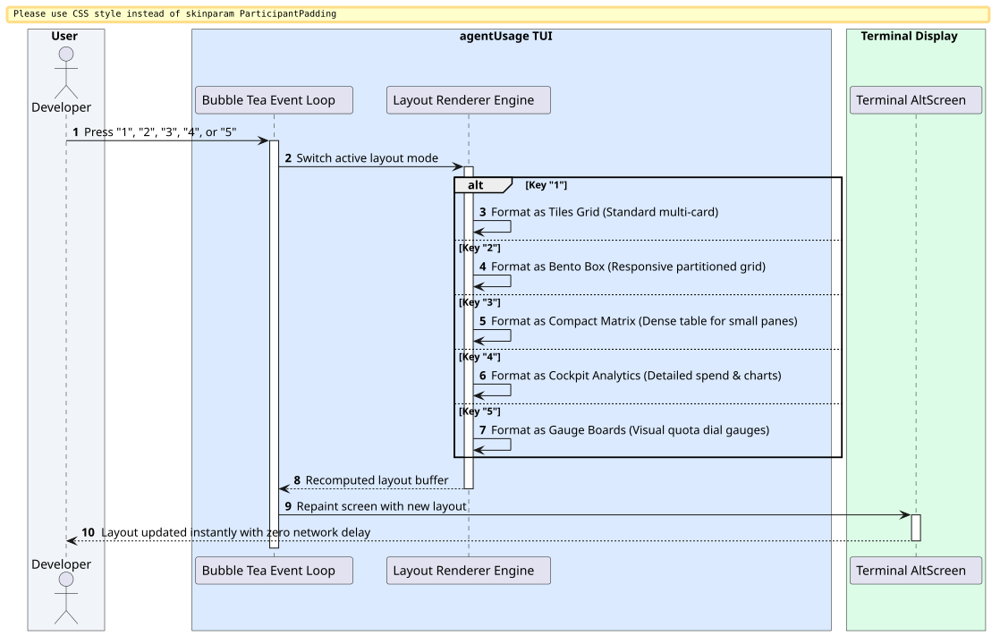

View Diagram Source

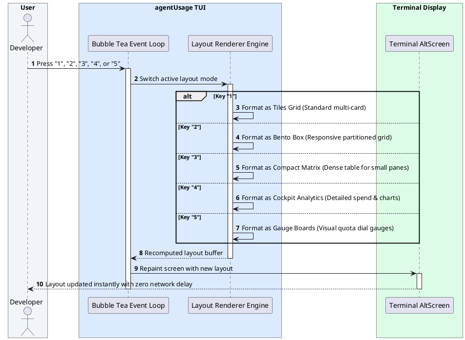
```plantuml
@startuml
autonumber
skinparam BoxPadding 15
skinparam ParticipantPadding 15

box "User" #F1F5F9
    actor User as "Developer"
end box

box "agentUsage TUI" #DBEAFE
    participant App as "Bubble Tea Event Loop"
    participant Layout as "Layout Renderer Engine"
end box

box "Terminal Display" #DCFCE7
    participant TTY as "Terminal AltScreen"
end box

User -> App : Press "1", "2", "3", "4", or "5"
activate App

App -> Layout : Switch active layout mode
activate Layout

alt Key "1"
    Layout -> Layout : Format as Tiles Grid (Standard multi-card)
else Key "2"
    Layout -> Layout : Format as Bento Box (Responsive partitioned grid)
else Key "3"
    Layout -> Layout : Format as Compact Matrix (Dense table for small panes)
else Key "4"
    Layout -> Layout : Format as Cockpit Analytics (Detailed spend & charts)
else Key "5"
    Layout -> Layout : Format as Gauge Boards (Visual quota dial gauges)
end

Layout --> App : Recomputed layout buffer
deactivate Layout

App -> TTY : Repaint screen with new layout
activate TTY
TTY --> User : Layout updated instantly with zero network delay
deactivate TTY
deactivate App
@enduml
```

#### How it functions:
1. While monitoring in the dashboard, press any number key from `1` through `5` (or press `Tab` to cycle views).
2. Key `1` renders the **Tiles Grid** (default responsive cards with token and rate limit gauges).
3. Key `2` switches to **Bento Box** (modern partitioned layout balancing high-priority accounts and summary widgets).
4. Key `3` activates **Compact Matrix** (condensed multi-column rows, ideal for narrow tmux side splits).
5. Key `4` opens **Cockpit Analytics** (in-depth token velocity, burn rate curves, and hourly breakdowns).
6. Key `5` displays **Gauge Boards** (circular visual dials focusing on remaining rate limit headroom).
7. The transition is instantaneous and uses cached telemetry data without re-triggering API calls.

---

### 1.3 Time Window Cycling & Quota Horizons (`w` / `1`–`7`)

#### What does it do?
Shifts the aggregation horizon across 6 standard analytical windows: 5 Hours (the standard rolling rate-limit window used by Claude Code and Codex), 24 Hours (daily burn), 7 Days / Weekly, 30 Days / Monthly, Billing Cycle, and Lifetime. All usage percentages, cost calculations, and progress gauges dynamically recalculate.

#### Functional Sequence Diagram

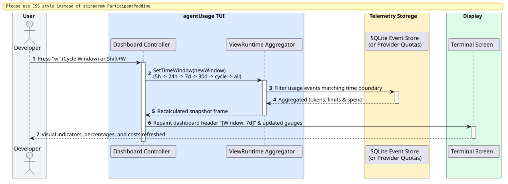

View Diagram Source

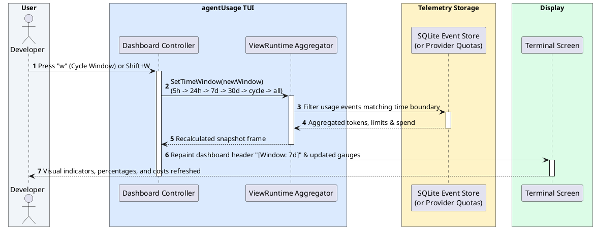
```plantuml
@startuml
autonumber
skinparam BoxPadding 15
skinparam ParticipantPadding 15

box "User" #F1F5F9
    actor User as "Developer"
end box

box "agentUsage TUI" #DBEAFE
    participant App as "Dashboard Controller"
    participant ViewRT as "ViewRuntime Aggregator"
end box

box "Telemetry Storage" #FEF3C7
    participant Store as "SQLite Event Store\n(or Provider Quotas)"
end box

box "Display" #DCFCE7
    participant TTY as "Terminal Screen"
end box

User -> App : Press "w" (Cycle Window) or Shift+W
activate App

App -> ViewRT : SetTimeWindow(newWindow)\n(5h -> 24h -> 7d -> 30d -> cycle -> all)
activate ViewRT

ViewRT -> Store : Filter usage events matching time boundary
activate Store
Store --> ViewRT : Aggregated tokens, limits & spend
deactivate Store

ViewRT --> App : Recalculated snapshot frame
deactivate ViewRT

App -> TTY : Repaint dashboard header "[Window: 7d]" & updated gauges
activate TTY
TTY --> User : Visual indicators, percentages, and costs refreshed
deactivate TTY
deactivate App
@enduml
```

#### How it functions:
1. In the dashboard, press `w` to cycle forward through time windows (or `Shift+W` to cycle backward).
2. The header tag updates to reflect the active window: `[Window: 5h]`, `[Window: 24h]`, `[Window: 7d]`, etc.
3. For rolling windows (like 5h), gauges reflect current rate limit proximity and remaining headroom before throttling.
4. For periodic windows (24h, 7d, 30d), gauges reflect total token consumption and cumulative financial spend against monthly or weekly budgets.

---

### 1.4 In-App Account Setup Modal (`a` / Add Account)

#### What does it do?
Opens an interactive modal form directly inside the terminal interface to configure a new AI provider account (OpenAI, Anthropic, Cursor, OpenRouter, Perplexity, Gemini, etc.), validate credentials, and persist secrets to `credentials.json` with strict `0600` permissions.

#### Functional Sequence Diagram

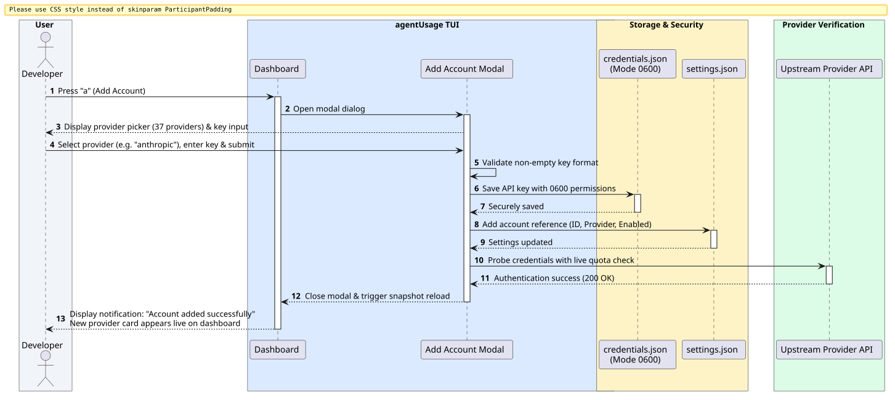

View Diagram Source

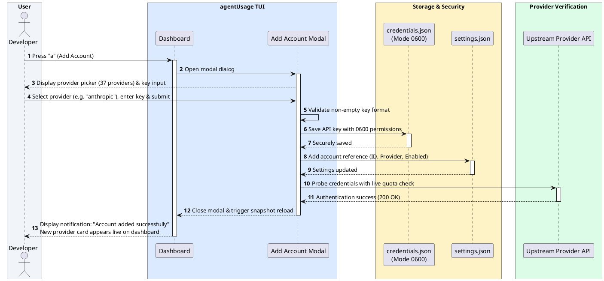
```plantuml
@startuml
autonumber
skinparam BoxPadding 15
skinparam ParticipantPadding 15

box "User" #F1F5F9
    actor User as "Developer"
end box

box "agentUsage TUI" #DBEAFE
    participant App as "Dashboard"
    participant Modal as "Add Account Modal"
end box

box "Storage & Security" #FEF3C7
    participant Creds as "credentials.json\n(Mode 0600)"
    participant Settings as "settings.json"
end box

box "Provider Verification" #DCFCE7
    participant API as "Upstream Provider API"
end box

User -> App : Press "a" (Add Account)
activate App

App -> Modal : Open modal dialog
activate Modal
Modal --> User : Display provider picker (37 providers) & key input

User -> Modal : Select provider (e.g. "anthropic"), enter key & submit
Modal -> Modal : Validate non-empty key format

Modal -> Creds : Save API key with 0600 permissions
activate Creds
Creds --> Modal : Securely saved
deactivate Creds

Modal -> Settings : Add account reference (ID, Provider, Enabled)
activate Settings
Settings --> Modal : Settings updated
deactivate Settings

Modal -> API : Probe credentials with live quota check
activate API
API --> Modal : Authentication success (200 OK)
deactivate API

Modal --> App : Close modal & trigger snapshot reload
deactivate Modal

App --> User : Display notification: "Account added successfully"\nNew provider card appears live on dashboard
deactivate App
@enduml
```

#### How it functions:
1. Press `a` anywhere in the dashboard to open the Add Account modal overlay.
2. Select your provider from the list of 37 supported providers using the arrow keys.
3. Enter an account identifier and paste your API key or session token (input is masked for privacy).
4. Press Enter to submit. `agentUsage` validates the key format, writes secrets to `~/.config/agentusage/credentials.json` with mode `0600` (readable only by your user), and saves account metadata to `settings.json`.
5. The system performs an immediate verification check, closes the modal, and renders the new provider's live metrics card.

---

### 1.5 Preferences, Themes & Threshold Settings (`s` / Settings Modal)

#### What does it do?
Opens the settings modal to customize visual themes (Gruvbox, Nord, Catppuccin, Tokyo Night, Dracula, Monokai, etc.), configure refresh intervals, adjust warning/critical quota threshold percentages (e.g. warning at 70%, critical at 90%), and toggle cost visibility.

#### Functional Sequence Diagram

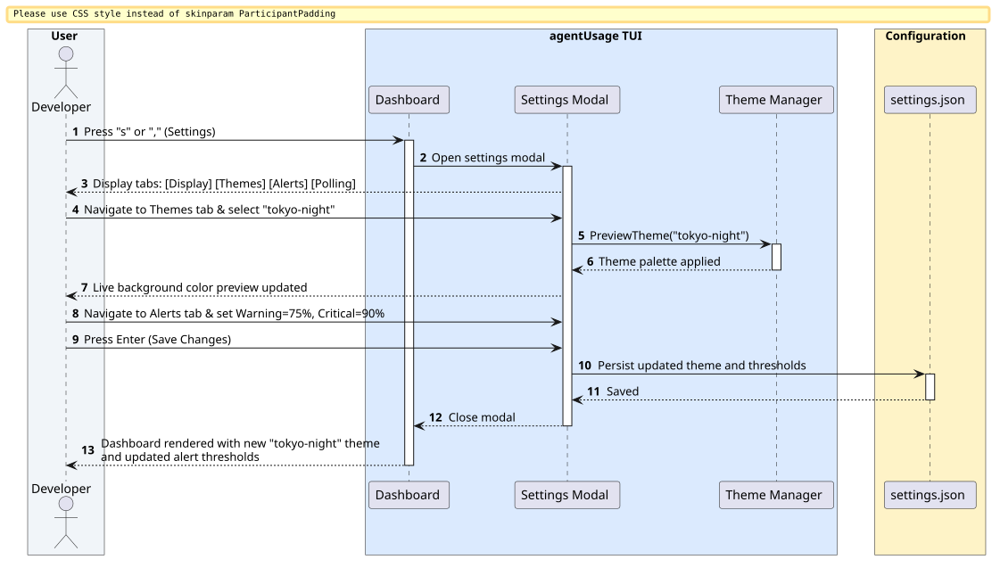

View Diagram Source

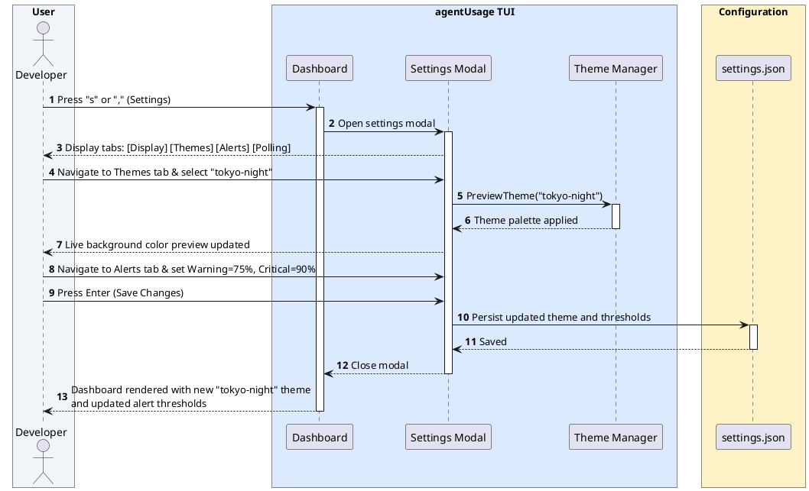
```plantuml
@startuml
autonumber
skinparam BoxPadding 15
skinparam ParticipantPadding 15

box "User" #F1F5F9
    actor User as "Developer"
end box

box "agentUsage TUI" #DBEAFE
    participant App as "Dashboard"
    participant SettingsUI as "Settings Modal"
    participant ThemeMgr as "Theme Manager"
end box

box "Configuration" #FEF3C7
    participant Config as "settings.json"
end box

User -> App : Press "s" or "," (Settings)
activate App

App -> SettingsUI : Open settings modal
activate SettingsUI
SettingsUI --> User : Display tabs: [Display] [Themes] [Alerts] [Polling]

User -> SettingsUI : Navigate to Themes tab & select "tokyo-night"
SettingsUI -> ThemeMgr : PreviewTheme("tokyo-night")
activate ThemeMgr
ThemeMgr --> SettingsUI : Theme palette applied
deactivate ThemeMgr
SettingsUI --> User : Live background color preview updated

User -> SettingsUI : Navigate to Alerts tab & set Warning=75%, Critical=90%
User -> SettingsUI : Press Enter (Save Changes)

SettingsUI -> Config : Persist updated theme and thresholds
activate Config
Config --> SettingsUI : Saved
deactivate Config

SettingsUI --> App : Close modal
deactivate SettingsUI

App --> User : Dashboard rendered with new "tokyo-night" theme\nand updated alert thresholds
deactivate App
@enduml
```

#### How it functions:
1. Press `s` (or `,`) in the dashboard to open the Settings modal.
2. Use `Tab` to switch between tabs:
   - **Themes**: Live-preview 15+ curated dark/light color themes (Gruvbox, Nord, Tokyo Night, Catppuccin, etc.).
   - **Alerts**: Adjust quota warning and critical percentage thresholds.
   - **Display**: Toggle cost estimates, hide zero-usage accounts, and set widget density.
   - **Polling**: Configure background refresh intervals.
3. Press Enter to save. Changes persist immediately to `~/.config/agentusage/settings.json`.

---

## 2. Command-Line Inspection & Auditing (CLI)

For command-line automation, scripting, and tmux statusline integration, `agentUsage` offers fast non-interactive subcommands.

---

### 2.1 `agentusage get <id>` (Fast Quota & Rate Limit Query)

#### What does it do?
Queries quota and usage for a specific provider account or box ID and outputs the results in JSON, formatted table, or clean plain-text. Ideal for shell scripts, prompt augmentations, and tmux statusline segments.

#### Functional Sequence Diagram

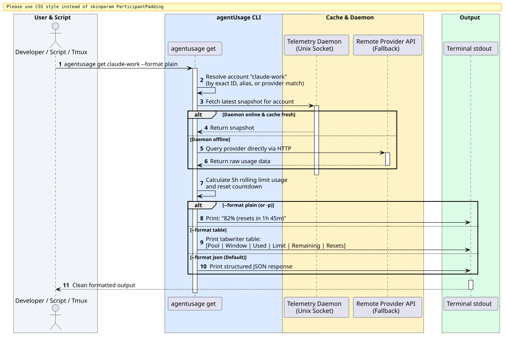

View Diagram Source

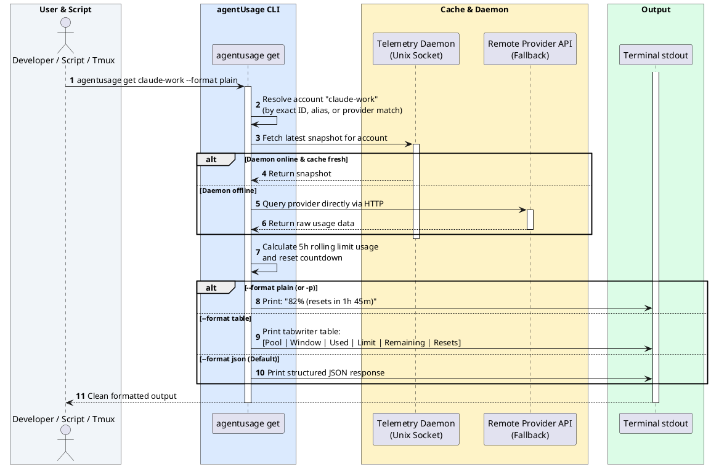
```plantuml
@startuml
autonumber
skinparam BoxPadding 15
skinparam ParticipantPadding 15

box "User & Script" #F1F5F9
    actor User as "Developer / Script / Tmux"
end box

box "agentUsage CLI" #DBEAFE
    participant CLI as "agentusage get"
end box

box "Cache & Daemon" #FEF3C7
    participant Cache as "Telemetry Daemon\n(Unix Socket)"
    participant Remote as "Remote Provider API\n(Fallback)"
end box

box "Output" #DCFCE7
    participant Stdout as "Terminal stdout"
end box

User -> CLI : agentusage get claude-work --format plain
activate CLI

CLI -> CLI : Resolve account "claude-work"\n(by exact ID, alias, or provider match)

CLI -> Cache : Fetch latest snapshot for account
activate Cache

alt Daemon online & cache fresh
    Cache --> CLI : Return snapshot
else Daemon offline
    CLI -> Remote : Query provider directly via HTTP
    activate Remote
    Remote --> CLI : Return raw usage data
    deactivate Remote
end
deactivate Cache

CLI -> CLI : Calculate 5h rolling limit usage\nand reset countdown

alt --format plain (or -p)
    CLI -> Stdout : Print: "82% (resets in 1h 45m)"
else --format table
    CLI -> Stdout : Print tabwriter table:\n[Pool | Window | Used | Limit | Remaining | Resets]
else --format json (Default)
    CLI -> Stdout : Print structured JSON response
end
activate Stdout
Stdout --> User : Clean formatted output
deactivate Stdout
deactivate CLI
@enduml
```

#### How it functions:
1. Run `agentusage get <account_id>` (e.g. `agentusage get claude` or `agentusage get openai-dev`).
2. Add `--format plain` to produce a single-line summary ideal for tmux statuslines: `82% (resets in 1h 45m)`.
3. Add `--format table` to render a human-readable ASCII table with pool limits and reset windows.
4. By default, outputs structured JSON including token totals, dollar spend, limit ceilings, and exact reset timestamps.

---

### 2.2 `agentusage list` / `ls` (Inventory of Accounts & Container Health)

#### What does it do?
Prints an inventory of all provider accounts—both explicitly configured in `settings.json` and auto-detected on your workstation—including their authentication status, credential source, and container health.

#### Functional Sequence Diagram

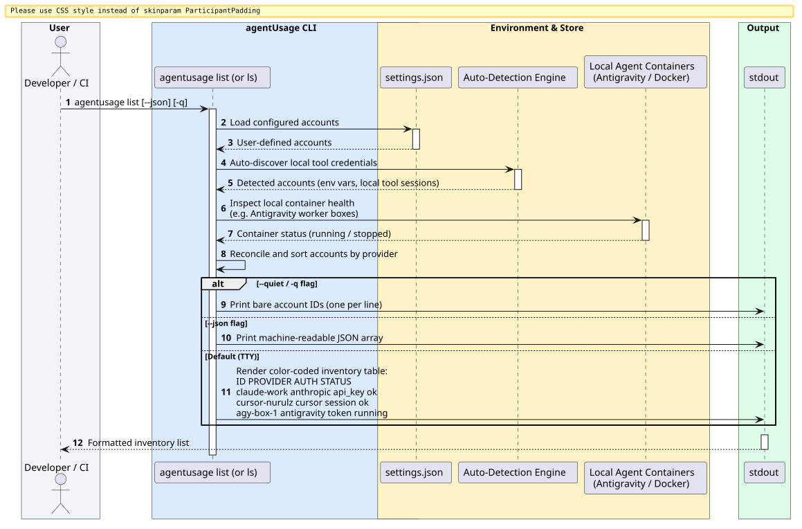

View Diagram Source

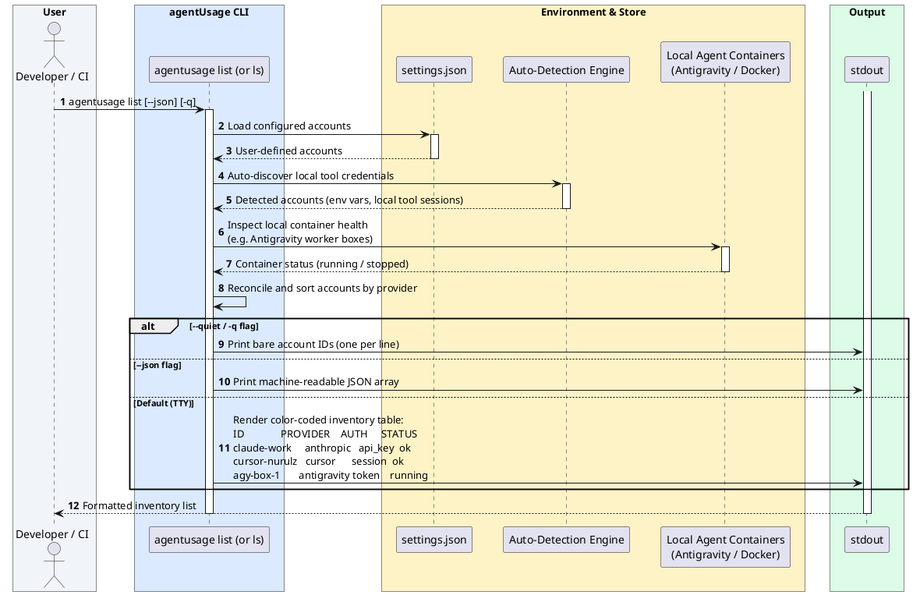
```plantuml
@startuml
autonumber
skinparam BoxPadding 15
skinparam ParticipantPadding 15

box "User" #F1F5F9
    actor User as "Developer / CI"
end box

box "agentUsage CLI" #DBEAFE
    participant CLI as "agentusage list (or ls)"
end box

box "Environment & Store" #FEF3C7
    participant Config as "settings.json"
    participant Auto as "Auto-Detection Engine"
    participant Containers as "Local Agent Containers\n(Antigravity / Docker)"
end box

box "Output" #DCFCE7
    participant Stdout as "stdout"
end box

User -> CLI : agentusage list [--json] [-q]
activate CLI

CLI -> Config : Load configured accounts
activate Config
Config --> CLI : User-defined accounts
deactivate Config

CLI -> Auto : Auto-discover local tool credentials
activate Auto
Auto --> CLI : Detected accounts (env vars, local tool sessions)
deactivate Auto

CLI -> Containers : Inspect local container health\n(e.g. Antigravity worker boxes)
activate Containers
Containers --> CLI : Container status (running / stopped)
deactivate Containers

CLI -> CLI : Reconcile and sort accounts by provider

alt --quiet / -q flag
    CLI -> Stdout : Print bare account IDs (one per line)
else --json flag
    CLI -> Stdout : Print machine-readable JSON array
else Default (TTY)
    CLI -> Stdout : Render color-coded inventory table:\nID              PROVIDER    AUTH     STATUS\nclaude-work     anthropic   api_key  ok\ncursor-nurulz   cursor      session  ok\nagy-box-1       antigravity token    running
end
activate Stdout
Stdout --> User : Formatted inventory list
deactivate Stdout
deactivate CLI
@enduml
```

#### How it functions:
1. Run `agentusage list` (or `agentusage ls`).
2. The command aggregates explicitly configured accounts alongside auto-detected workstation tools.
3. For containerized local agents (e.g. Antigravity boxes), it probes runtime health to confirm whether the container is running.
4. Outputs an aligned table showing Account ID, Provider, Auth Mode, and Status (`ok`, `running`, `missing_token`, `no_key`).
5. Pass `-q` to extract bare IDs for piping into other tools.

---

### 2.3 `agentusage detect` (Workstation Credential & Tool Auto-Discovery)

#### What does it do?
Automatically scans your local workstation environment—including `$PATH` binaries, default config directories, and environment variables—to find existing AI coding tools and credentials without writing anything to disk.

#### Functional Sequence Diagram

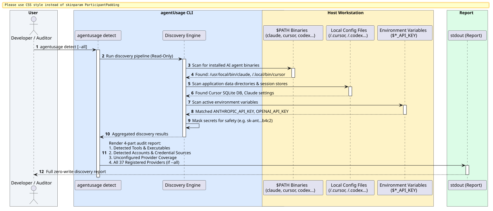

View Diagram Source

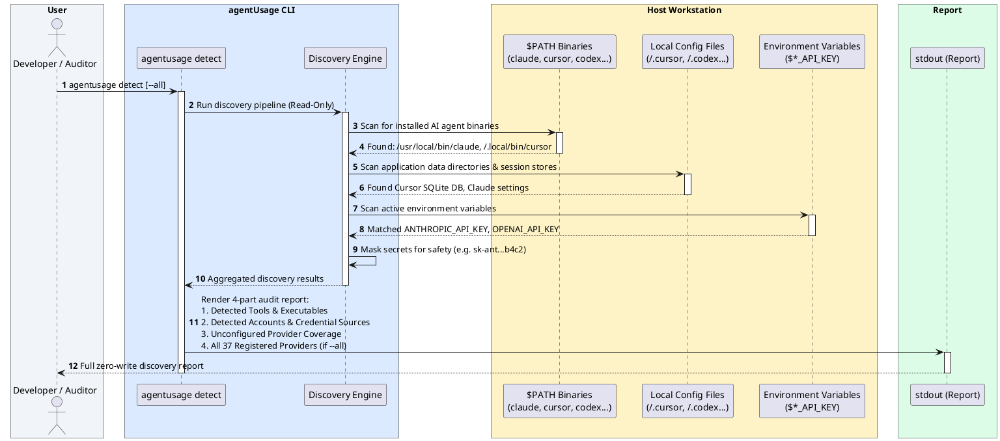
```plantuml
@startuml
autonumber
skinparam BoxPadding 15
skinparam ParticipantPadding 15

box "User" #F1F5F9
    actor User as "Developer / Auditor"
end box

box "agentUsage CLI" #DBEAFE
    participant CLI as "agentusage detect"
    participant Engine as "Discovery Engine"
end box

box "Host Workstation" #FEF3C7
    participant PATH as "$PATH Binaries\n(claude, cursor, codex...)"
    participant FS as "Local Config Files\n(~/.cursor, ~/.codex...)"
    participant Env as "Environment Variables\n($*_API_KEY)"
end box

box "Report" #DCFCE7
    participant Stdout as "stdout (Report)"
end box

User -> CLI : agentusage detect [--all]
activate CLI

CLI -> Engine : Run discovery pipeline (Read-Only)
activate Engine

Engine -> PATH : Scan for installed AI agent binaries
activate PATH
PATH --> Engine : Found: /usr/local/bin/claude, ~/.local/bin/cursor
deactivate PATH

Engine -> FS : Scan application data directories & session stores
activate FS
FS --> Engine : Found Cursor SQLite DB, Claude settings
deactivate FS

Engine -> Env : Scan active environment variables
activate Env
Env --> Engine : Matched ANTHROPIC_API_KEY, OPENAI_API_KEY
deactivate Env

Engine -> Engine : Mask secrets for safety (e.g. sk-ant...b4c2)
Engine --> CLI : Aggregated discovery results
deactivate Engine

CLI -> Stdout : Render 4-part audit report:\n1. Detected Tools & Executables\n2. Detected Accounts & Credential Sources\n3. Unconfigured Provider Coverage\n4. All 37 Registered Providers (if --all)
activate Stdout
Stdout --> User : Full zero-write discovery report
deactivate Stdout
deactivate CLI
@enduml
```

#### How it functions:
1. Run `agentusage detect` on any developer machine.
2. The command performs a non-destructive read-only audit across three sources:
   - **Binaries**: Checks `$PATH` for tools like Claude Code, Cursor, Codex, OpenCode, Ollama.
   - **Filesystem**: Checks local application state directories (e.g. `~/.cursor`, `~/.codex`).
   - **Environment**: Checks for standard provider environment variables (`OPENAI_API_KEY`, etc.).
3. Displays a formatted report showing detected tools, matched accounts with masked keys (`sk-...4a1b`), and provider coverage gaps.
4. Pass `--all` to print the full directory of all 37 supported AI providers.

---

### 2.4 `agentusage doctor` (Comprehensive System & Environment Diagnostics)

#### What does it do?
Runs an automated 5-point health check across the operating system environment, file permissions, daemon socket, SQLite database integrity, integration hooks, and tmux statuslines, providing instant troubleshooting guidance.

#### Functional Sequence Diagram

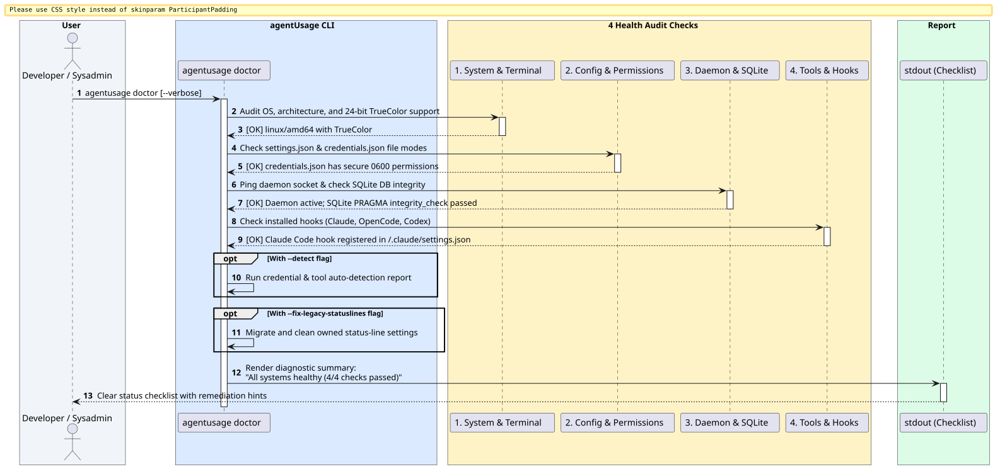

View Diagram Source

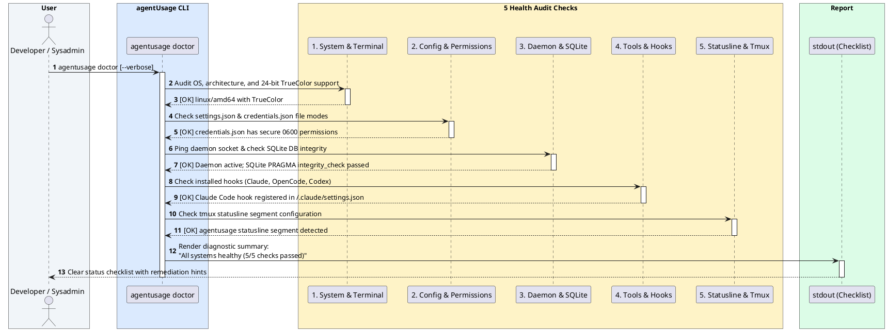
```plantuml
@startuml
autonumber
skinparam BoxPadding 15
skinparam ParticipantPadding 15

box "User" #F1F5F9
    actor User as "Developer / Sysadmin"
end box

box "agentUsage CLI" #DBEAFE
    participant Doctor as "agentusage doctor"
end box

box "5 Health Audit Checks" #FEF3C7
    participant Sys as "1. System & Terminal"
    participant Sec as "2. Config & Permissions"
    participant Daemon as "3. Daemon & SQLite"
    participant Hooks as "4. Tools & Hooks"
    participant Tmux as "5. Statusline & Tmux"
end box

box "Report" #DCFCE7
    participant Stdout as "stdout (Checklist)"
end box

User -> Doctor : agentusage doctor [--verbose]
activate Doctor

Doctor -> Sys : Audit OS, architecture, and 24-bit TrueColor support
activate Sys
Sys --> Doctor : [OK] linux/amd64 with TrueColor
deactivate Sys

Doctor -> Sec : Check settings.json & credentials.json file modes
activate Sec
Sec --> Doctor : [OK] credentials.json has secure 0600 permissions
deactivate Sec

Doctor -> Daemon : Ping daemon socket & check SQLite DB integrity
activate Daemon
Daemon --> Doctor : [OK] Daemon active; SQLite PRAGMA integrity_check passed
deactivate Daemon

Doctor -> Hooks : Check installed hooks (Claude, OpenCode, Codex)
activate Hooks
Hooks --> Doctor : [OK] Claude Code hook registered in ~/.claude/settings.json
deactivate Hooks

Doctor -> Tmux : Check tmux statusline segment configuration
activate Tmux
Tmux --> Doctor : [OK] agentusage statusline segment detected
deactivate Tmux

Doctor -> Stdout : Render diagnostic summary:\n"All systems healthy (5/5 checks passed)"
activate Stdout
Stdout --> User : Clear status checklist with remediation hints
deactivate Stdout
deactivate Doctor
@enduml
```

#### How it functions:
1. Run `agentusage doctor` whenever diagnosing unexpected behavior or after installing updates.
2. The command audits 5 critical subsystems sequentially:
   - **System & Terminal**: Verifies OS, Go architecture, and terminal color capability (`COLORTERM=truecolor`).
   - **Config & Security**: Verifies configuration validity and flags unsafe credential permissions (warns if not `0600`).
   - **Daemon & Database**: Checks Unix socket responsiveness and runs SQLite `PRAGMA integrity_check`.
   - **Tools & Hooks**: Inspects hook scripts for Claude Code, OpenCode, and Codex.
   - **Tmux & Statusline**: Confirms presence of statusline helpers in `~/.tmux.conf`.
3. Passes with exit code `0` when all systems are healthy, or displays actionable remediation hints for any warning or failure.

---

## 3. Web Dashboard & Remote Monitoring

For team visibility, secondary monitors, or browser-based monitoring, `agentUsage` provides a built-in web dashboard server.

---

### 3.1 `agentusage serve` (Launch Browser Web Dashboard)

#### What does it do?
Hosts a responsive web-based dashboard on your local machine (default `http://127.0.0.1:8080`), rendering the same live snapshot cards, rate limit bars, and token analytics in your browser.

#### Functional Sequence Diagram

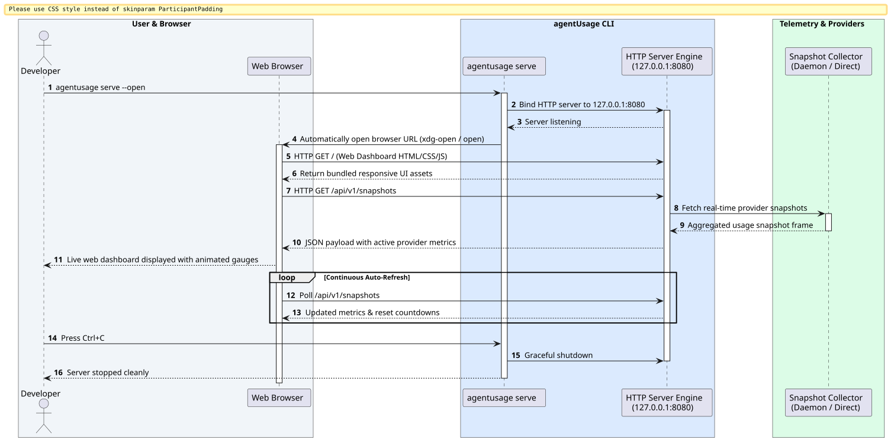

View Diagram Source

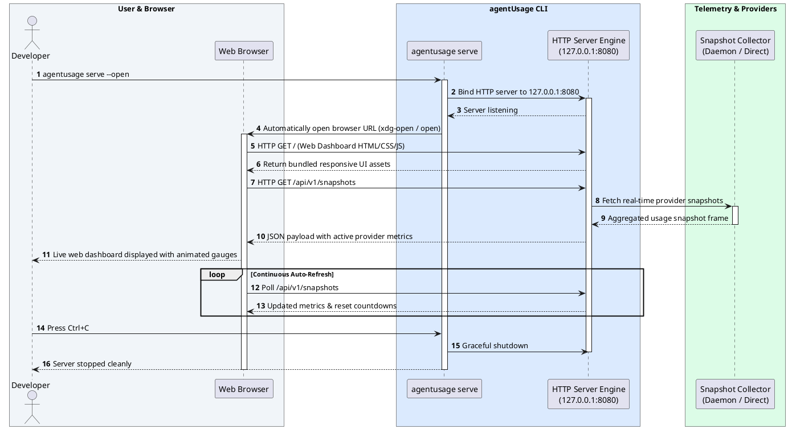
```plantuml
@startuml
autonumber
skinparam BoxPadding 15
skinparam ParticipantPadding 15

box "User & Browser" #F1F5F9
    actor User as "Developer"
    participant Browser as "Web Browser"
end box

box "agentUsage CLI" #DBEAFE
    participant CLI as "agentusage serve"
    participant WebServer as "HTTP Server Engine\n(127.0.0.1:8080)"
end box

box "Telemetry & Providers" #DCFCE7
    participant Collector as "Snapshot Collector\n(Daemon / Direct)"
end box

User -> CLI : agentusage serve --open
activate CLI

CLI -> WebServer : Bind HTTP server to 127.0.0.1:8080
activate WebServer
WebServer --> CLI : Server listening

CLI -> Browser : Automatically open browser URL (xdg-open / open)
activate Browser

Browser -> WebServer : HTTP GET / (Web Dashboard HTML/CSS/JS)
WebServer --> Browser : Return bundled responsive UI assets

Browser -> WebServer : HTTP GET /api/v1/snapshots
WebServer -> Collector : Fetch real-time provider snapshots
activate Collector
Collector --> WebServer : Aggregated usage snapshot frame
deactivate Collector
WebServer --> Browser : JSON payload with active provider metrics

Browser --> User : Live web dashboard displayed with animated gauges

loop Continuous Auto-Refresh
    Browser -> WebServer : Poll /api/v1/snapshots
    WebServer --> Browser : Updated metrics & reset countdowns
end

User -> CLI : Press Ctrl+C
CLI -> WebServer : Graceful shutdown
deactivate WebServer
CLI --> User : Server stopped cleanly
deactivate CLI
deactivate Browser
@enduml
```

#### How it functions:
1. Run `agentusage serve --open` (or `agentusage serve --listen 127.0.0.1:8080`).
2. The server starts and launches your default web browser automatically.
3. The web UI displays real-time cards, token burn velocity, and quota reset timers matching the terminal TUI.
4. Auto-refresh keeps the browser updated in real-time. Press `Ctrl+C` in your terminal to shut down the server.

---

### 3.2 `agentusage serve --detach` & `--stop` (Background Web Daemon Lifecycle)

#### What does it do?
Runs the web dashboard as a background daemon detached from your terminal, persisting across terminal closes with PID tracking and health checks, and provides `--stop` to terminate cleanly.

#### Functional Sequence Diagram

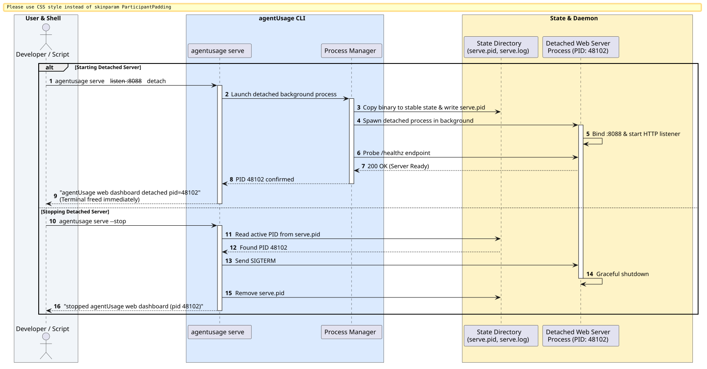

View Diagram Source

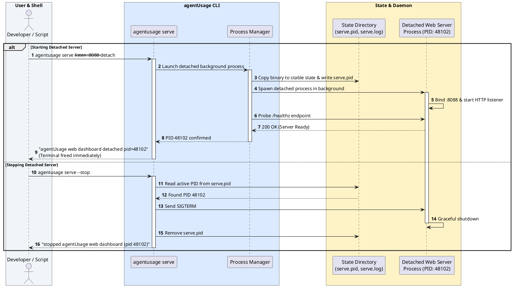
```plantuml
@startuml
autonumber
skinparam BoxPadding 15
skinparam ParticipantPadding 15

box "User & Shell" #F1F5F9
    actor User as "Developer / Script"
end box

box "agentUsage CLI" #DBEAFE
    participant CLI as "agentusage serve"
    participant Manager as "Process Manager"
end box

box "State & Daemon" #FEF3C7
    participant StateDir as "State Directory\n(serve.pid, serve.log)"
    participant Daemon as "Detached Web Server\nProcess (PID: 48102)"
end box

alt Starting Detached Server
    User -> CLI : agentusage serve --listen :8088 --detach
    activate CLI
    CLI -> Manager : Launch detached background process
    activate Manager
    Manager -> StateDir : Copy binary to stable state & write serve.pid
    Manager -> Daemon : Spawn detached process in background
    activate Daemon
    Daemon -> Daemon : Bind :8088 & start HTTP listener
    Manager -> Daemon : Probe /healthz endpoint
    Daemon --> Manager : 200 OK (Server Ready)
    Manager --> CLI : PID 48102 confirmed
    deactivate Manager
    CLI --> User : "agentUsage web dashboard detached pid=48102"\n(Terminal freed immediately)
    deactivate CLI
else Stopping Detached Server
    User -> CLI : agentusage serve --stop
    activate CLI
    CLI -> StateDir : Read active PID from serve.pid
    StateDir --> CLI : Found PID 48102
    CLI -> Daemon : Send SIGTERM
    Daemon -> Daemon : Graceful shutdown
    deactivate Daemon
    CLI -> StateDir : Remove serve.pid
    CLI --> User : "stopped agentUsage web dashboard (pid 48102)"
    deactivate CLI
end
@enduml
```

#### How it functions:
1. Run `agentusage serve --detach` to start the web dashboard as an independent background daemon.
2. The command verifies the server is healthy by probing `/healthz`, saves the process ID to `~/.local/state/agentusage/serve.pid`, and immediately frees your terminal.
3. Logs are written to `~/.local/state/agentusage/serve.log`.
4. Run `agentusage serve --stop` at any time to cleanly terminate the background process and clean up state.

---

### 3.3 `agentusage serve --verify` (TUI-to-Web Parity Validation)

#### What does it do?
Validates that the web dashboard and terminal TUI present identical data. It captures both view models simultaneously and verifies matching account lists, usage percentages, badges, and reset countdowns (used in CI/CD and manual audits).

#### Functional Sequence Diagram

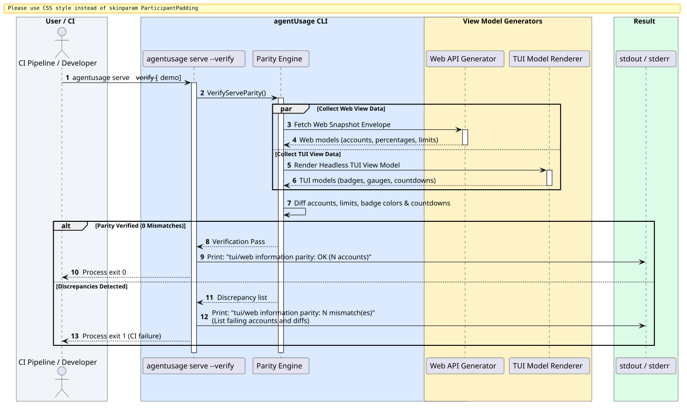

View Diagram Source

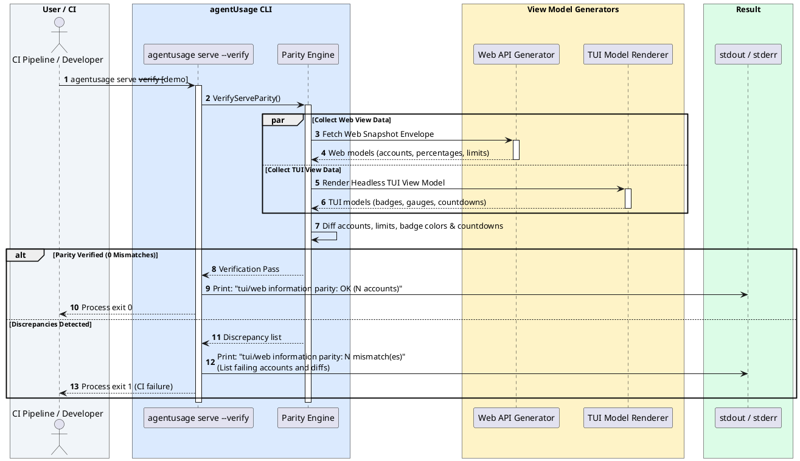
```plantuml
@startuml
autonumber
skinparam BoxPadding 15
skinparam ParticipantPadding 15

box "User / CI" #F1F5F9
    actor User as "CI Pipeline / Developer"
end box

box "agentUsage CLI" #DBEAFE
    participant CLI as "agentusage serve --verify"
    participant Engine as "Parity Engine"
end box

box "View Model Generators" #FEF3C7
    participant WebGen as "Web API Generator"
    participant TUIGen as "TUI Model Renderer"
end box

box "Result" #DCFCE7
    participant Output as "stdout / stderr"
end box

User -> CLI : agentusage serve --verify [--demo]
activate CLI

CLI -> Engine : VerifyServeParity()
activate Engine

par Collect Web View Data
    Engine -> WebGen : Fetch Web Snapshot Envelope
    activate WebGen
    WebGen --> Engine : Web models (accounts, percentages, limits)
    deactivate WebGen
else Collect TUI View Data
    Engine -> TUIGen : Render Headless TUI View Model
    activate TUIGen
    TUIGen --> Engine : TUI models (badges, gauges, countdowns)
    deactivate TUIGen
end

Engine -> Engine : Diff accounts, limits, badge colors & countdowns

alt Parity Verified (0 Mismatches)
    Engine --> CLI : Verification Pass
    CLI -> Output : Print: "tui/web information parity: OK (N accounts)"
    CLI --> User : Process exit 0
else Discrepancies Detected
    Engine --> CLI : Discrepancy list
    CLI -> Output : Print: "tui/web information parity: N mismatch(es)"\n(List failing accounts and diffs)
    CLI --> User : Process exit 1 (CI failure)
end
deactivate Engine
deactivate CLI
@enduml
```

#### How it functions:
1. Execute `agentusage serve --verify` (or `agentusage serve --verify --demo` for synthetic data).
2. The verification engine collects view models from both the Web API and the Bubble Tea TUI renderer simultaneously.
3. It performs a comprehensive field-by-field comparison of account IDs, usage percentages, threshold badge colors, and reset timers.
4. Exits code `0` on full parity, or `1` with a detailed difference report to safeguard against UI drift.

---

## 4. Telemetry Daemon & Coding Assistant Hook Ingestion

The telemetry daemon runs as a lightweight local background service responsible for persistent metric collection, hook ingestion, and SQLite storage.

---

### 4.1 `agentusage daemon run` & `status` (Daemon Lifecycle & Health Inspection)

#### What does it do?
Runs the local telemetry daemon in the background to poll provider rate limits, ingest hook events, and maintain a local SQLite database, or inspects the daemon's runtime status, socket connectivity, uptime, and database size.

#### Functional Sequence Diagram

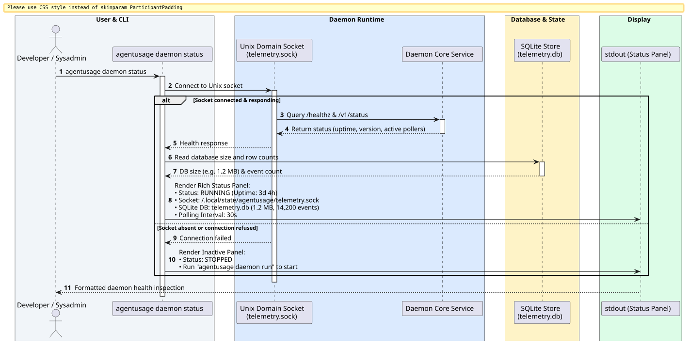

View Diagram Source

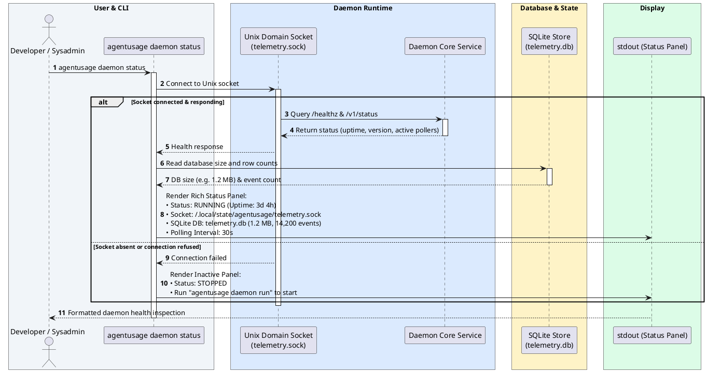
```plantuml
@startuml
autonumber
skinparam BoxPadding 15
skinparam ParticipantPadding 15

box "User & CLI" #F1F5F9
    actor User as "Developer / Sysadmin"
    participant CLI as "agentusage daemon status"
end box

box "Daemon Runtime" #DBEAFE
    participant Sock as "Unix Domain Socket\n(telemetry.sock)"
    participant Svc as "Daemon Core Service"
end box

box "Database & State" #FEF3C7
    participant DB as "SQLite Store\n(telemetry.db)"
end box

box "Display" #DCFCE7
    participant Stdout as "stdout (Status Panel)"
end box

User -> CLI : agentusage daemon status
activate CLI

CLI -> Sock : Connect to Unix socket
activate Sock

alt Socket connected & responding
    Sock -> Svc : Query /healthz & /v1/status
    activate Svc
    Svc --> Sock : Return status (uptime, version, active pollers)
    deactivate Svc
    Sock --> CLI : Health response
    CLI -> DB : Read database size and row counts
    activate DB
    DB --> CLI : DB size (e.g. 1.2 MB) & event count
    deactivate DB
    CLI -> Stdout : Render Rich Status Panel:\n• Status: RUNNING (Uptime: 3d 4h)\n• Socket: ~/.local/state/agentusage/telemetry.sock\n• SQLite DB: telemetry.db (1.2 MB, 14,200 events)\n• Polling Interval: 30s
else Socket absent or connection refused
    Sock --> CLI : Connection failed
    CLI -> Stdout : Render Inactive Panel:\n• Status: STOPPED\n• Run "agentusage daemon run" to start
end
deactivate Sock

Stdout --> User : Formatted daemon health inspection
deactivate CLI
@enduml
```

#### How it functions:
1. Run `agentusage daemon status` to inspect the background telemetry daemon.
2. The CLI connects to `~/.local/state/agentusage/telemetry.sock` and queries daemon health.
3. If running, it displays uptime, polling intervals, SQLite database size, and total recorded usage events.
4. If stopped, it provides the exact command needed to launch or install the daemon.

---

### 4.2 `agentusage daemon install` & `uninstall` (System Service Registration)

#### What does it do?
Registers the telemetry daemon as a persistent user service with your operating system's service manager (`systemd` on Linux, `launchd` on macOS), ensuring automated start on boot and background metric gathering.

#### Functional Sequence Diagram

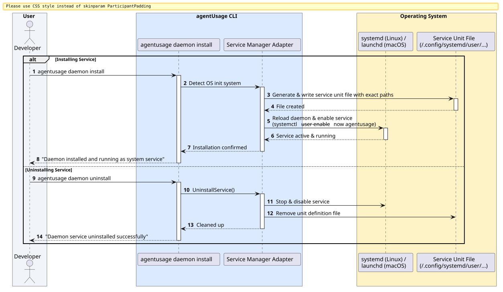

View Diagram Source

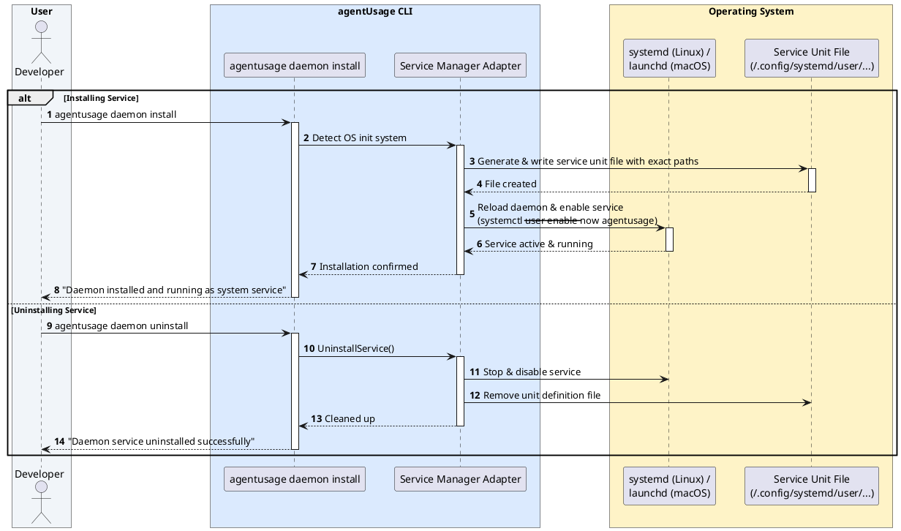
```plantuml
@startuml
autonumber
skinparam BoxPadding 15
skinparam ParticipantPadding 15

box "User" #F1F5F9
    actor User as "Developer"
end box

box "agentUsage CLI" #DBEAFE
    participant CLI as "agentusage daemon install"
    participant SvcMgr as "Service Manager Adapter"
end box

box "Operating System" #FEF3C7
    participant Init as "systemd (Linux) /\nlaunchd (macOS)"
    participant Unit as "Service Unit File\n(~/.config/systemd/user/...)"
end box

alt Installing Service
    User -> CLI : agentusage daemon install
    activate CLI
    CLI -> SvcMgr : Detect OS init system
    activate SvcMgr
    SvcMgr -> Unit : Generate & write service unit file with exact paths
    activate Unit
    Unit --> SvcMgr : File created
    deactivate Unit
    SvcMgr -> Init : Reload daemon & enable service\n(systemctl --user enable --now agentusage)
    activate Init
    Init --> SvcMgr : Service active & running
    deactivate Init
    SvcMgr --> CLI : Installation confirmed
    deactivate SvcMgr
    CLI --> User : "Daemon installed and running as system service"
    deactivate CLI
else Uninstalling Service
    User -> CLI : agentusage daemon uninstall
    activate CLI
    CLI -> SvcMgr : UninstallService()
    activate SvcMgr
    SvcMgr -> Init : Stop & disable service
    SvcMgr -> Unit : Remove unit definition file
    SvcMgr --> CLI : Cleaned up
    deactivate SvcMgr
    CLI --> User : "Daemon service uninstalled successfully"
    deactivate CLI
end
@enduml
```

#### How it functions:
1. Run `agentusage daemon install` (or press `i` inside the interactive dashboard).
2. `agentUsage` generates the appropriate user service configuration (`~/.config/systemd/user/agentusage-telemetry.service` on Linux or `~/Library/LaunchAgents/com.agentusage.telemetry.plist` on macOS).
3. It registers and starts the service immediately using your OS init system.
4. Telemetry collection and quota tracking now run automatically in the background across restarts.
5. Run `agentusage daemon uninstall` to completely remove the background service.

---

### 4.3 `agentusage daemon hook <source>` (Real-Time Coding Tool Hook Ingestion)

#### What does it do?
Ingests live usage events streamed from AI coding assistant hooks (Claude Code, OpenCode, Codex) via standard input or CLI argument, writing them directly into SQLite and updating live dashboards with sub-second latency.

#### Functional Sequence Diagram

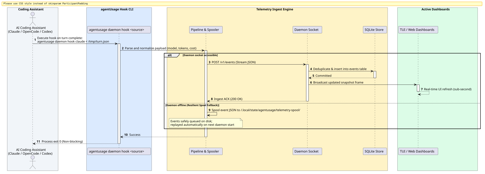

View Diagram Source

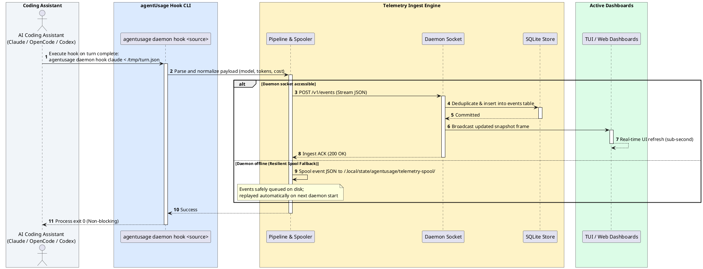
```plantuml
@startuml
autonumber
skinparam BoxPadding 15
skinparam ParticipantPadding 15

box "Coding Assistant" #F1F5F9
    actor Agent as "AI Coding Assistant\n(Claude / OpenCode / Codex)"
end box

box "agentUsage Hook CLI" #DBEAFE
    participant Hook as "agentusage daemon hook <source>"
end box

box "Telemetry Ingest Engine" #FEF3C7
    participant Pipe as "Pipeline & Spooler"
    participant Sock as "Daemon Socket"
    participant DB as "SQLite Store"
end box

box "Active Dashboards" #DCFCE7
    participant TUI as "TUI / Web Dashboards"
end box

Agent -> Hook : Execute hook on turn complete:\nagentusage daemon hook claude < /tmp/turn.json
activate Hook

Hook -> Pipe : Parse and normalize payload (model, tokens, cost)
activate Pipe

alt Daemon socket accessible
    Pipe -> Sock : POST /v1/events (Stream JSON)
    activate Sock
    Sock -> DB : Deduplicate & insert into events table
    activate DB
    DB --> Sock : Committed
    deactivate DB
    Sock -> TUI : Broadcast updated snapshot frame
    activate TUI
    TUI --> TUI : Real-time UI refresh (sub-second)
    deactivate TUI
    Sock --> Pipe : Ingest ACK (200 OK)
    deactivate Sock
else Daemon offline (Resilient Spool Fallback)
    Pipe -> Pipe : Spool event JSON to ~/.local/state/agentusage/telemetry-spool/
    note over Pipe : Events safely queued on disk;\nreplayed automatically on next daemon start
end

Pipe --> Hook : Success
deactivate Pipe
Hook --> Agent : Process exit 0 (Non-blocking)
deactivate Hook
@enduml
```

#### How it functions:
1. Integration hooks configure your coding assistant (e.g. Claude Code post-turn hook) to invoke `agentusage daemon hook <source>`.
2. When the agent completes an action, it pipes its execution transcript or token usage JSON to the hook command.
3. The hook normalizes model tokens, estimates costs, and writes the event to the daemon over the Unix socket.
4. If the daemon is temporarily offline, the hook writes the payload to a local spool directory (`telemetry-spool/`) so no usage data is ever lost.
5. All open TUI and Web dashboards update within milliseconds.

---

## 5. Simulation & Replay

For demonstration, offline testing, and UI development, `agentUsage` includes an interactive synthetic simulation runner.

---

### 5.1 `agentusage demo` (Synthetic Replay & Offline Preview)

#### What does it do?
Runs an interactive terminal dashboard using high-fidelity simulated usage snapshots and animated burn rates, allowing full feature evaluation, presentation demos, and UI theme testing without requiring real API keys or an internet connection.

#### Functional Sequence Diagram

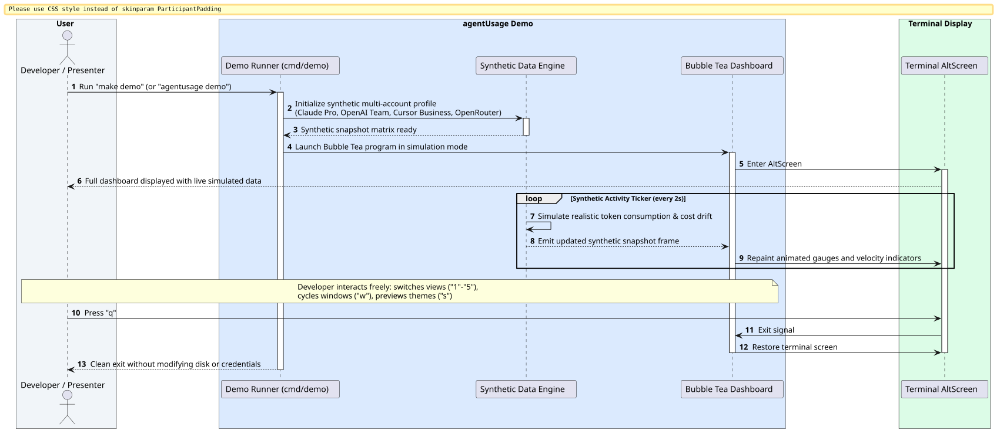

View Diagram Source

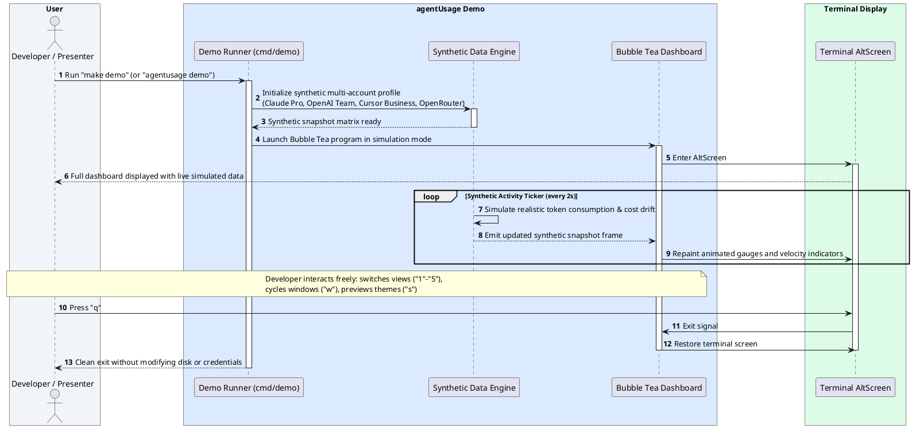
```plantuml
@startuml
autonumber
skinparam BoxPadding 15
skinparam ParticipantPadding 15

box "User" #F1F5F9
    actor User as "Developer / Presenter"
end box

box "agentUsage Demo" #DBEAFE
    participant Demo as "Demo Runner (cmd/demo)"
    participant Sim as "Synthetic Data Engine"
    participant TUI as "Bubble Tea Dashboard"
end box

box "Terminal Display" #DCFCE7
    participant TTY as "Terminal AltScreen"
end box

User -> Demo : Run "make demo" (or "agentusage demo")
activate Demo

Demo -> Sim : Initialize synthetic multi-account profile\n(Claude Pro, OpenAI Team, Cursor Business, OpenRouter)
activate Sim
Sim --> Demo : Synthetic snapshot matrix ready
deactivate Sim

Demo -> TUI : Launch Bubble Tea program in simulation mode
activate TUI

TUI -> TTY : Enter AltScreen
activate TTY
TTY --> User : Full dashboard displayed with live simulated data

loop Synthetic Activity Ticker (every 2s)
    Sim -> Sim : Simulate realistic token consumption & cost drift
    Sim --> TUI : Emit updated synthetic snapshot frame
    TUI -> TTY : Repaint animated gauges and velocity indicators
end

note over User, TUI : Developer interacts freely: switches views ("1"-"5"),\ncycles windows ("w"), previews themes ("s")

User -> TTY : Press "q"
TTY -> TUI : Exit signal
TUI -> TTY : Restore terminal screen
deactivate TTY
deactivate TUI
Demo --> User : Clean exit without modifying disk or credentials
deactivate Demo
@enduml
```

#### How it functions:
1. Run `make demo` (or run `./bin/demo`).
2. The simulation engine boots with 5 synthetic accounts representing different AI coding tools (Claude, OpenAI, Cursor, OpenRouter, Copilot).
3. A background ticker generates fluctuating token burns, animated gauge movements, and realistic reset countdowns.
4. You can explore all dashboard features—layout switching (`1`–`5`), time window cycling (`w`), and theme selection (`s`)—without an internet connection, API keys, or disk modifications.
5. Press `q` to exit cleanly.
